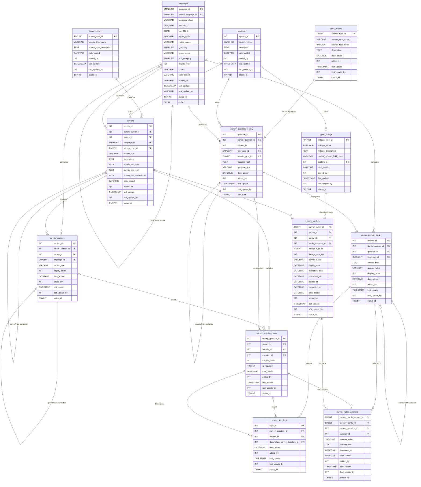

# FreshTrak Survey System — Database Schema

**Platform:** AWS RDS — MySQL 8.4  
**Last Updated:** 2026-02-10

---

## Table of Contents

1. [Overview](#overview)
2. [Entity Relationship Diagram](#entity-relationship-diagram)
3. [Table Relationships](#table-relationships)
4. [Schema Definitions (CREATE)](#schema-definitions)
5. [Sample Data (INSERT)](#sample-data)

---

## Overview

This schema supports a multi-tenant, multilingual survey platform for the social care space (charitable food, housing, and social determinants of health). Key design principles:

- **Reusable questions** — A master `survey_questions_library` table holds all questions; a `survey_question_map` mapping table assigns them to specific surveys, enabling the same question to appear across multiple surveys.
- **Standardized answers** — Pre-defined answer options live in the `survey_answer_library` table, linked to their parent question.
- **Multi-tenant (systems)** — The `systems` table is shared from PantryTrak via database sync. Multiple organizations (FreshTrak, Plentiful, Vivery, ReferNet, SIMC, VisionLink, Farmacy Connect, FoodFinder.us, etc.) can contribute questions and surveys to a centralized platform.
- **Multilingual support** — The `languages` table is a shared resource maintained in PantryTrak and synced to FreshTrak via database automation. It supports regional variants (e.g., Mexican Spanish, Caribbean Spanish) via a parent/child self-reference with BCP 47 locale codes, enabling fallback to the base language when a specific variant translation is unavailable. Surveys use a parent/child hierarchy for translations: the English version is the parent; translated versions (Spanish, Tagalog, etc.) are child records. Questions and answers follow the same pattern.
- **Skip logic** — Conditional branching allows different answer choices to route users to different questions.
- **Response tracking** — Surveys are "presented" to families, and timestamps track the lifecycle from presentation → started → completed (or abandoned).

### Standard Audit Fields

All tables include the following fields at the end of their column definitions:

| Field            | Type                                                      | Description                          |
| ---------------- | --------------------------------------------------------- | ------------------------------------ |
| `date_added`     | `DATETIME NOT NULL DEFAULT CURRENT_TIMESTAMP`             | Record creation timestamp            |
| `added_by`       | `INT NOT NULL DEFAULT 0`                                  | User ID of the record creator        |
| `last_update`    | `TIMESTAMP NULL DEFAULT NULL ON UPDATE CURRENT_TIMESTAMP` | Auto-updated on any row change       |
| `last_update_by` | `INT UNSIGNED NULL DEFAULT NULL`                          | User ID of last editor               |
| `status_id`      | `TINYINT UNSIGNED NOT NULL DEFAULT 1`                     | Row status: 1 = active, 2 = inactive |

---

## Entity Relationship Diagram



---

## Table Relationships

### Core Organizational Layer

| Parent Table                           | Child Table                | Relationship | Description                                                                                                              |
| -------------------------------------- | -------------------------- | ------------ | ------------------------------------------------------------------------------------------------------------------------ |
| `systems` _(shared from PantryTrak)_   | `surveys`                  | One-to-Many  | Each organization owns multiple surveys                                                                                  |
| `types_survey`                         | `surveys`                  | One-to-Many  | Classifies the purpose of each survey (feedback, screening, etc.)                                                        |
| `systems` _(shared from PantryTrak)_   | `survey_questions_library` | One-to-Many  | Tracks which system "owns" a question; questions can still be combined cross-system by researchers                       |
| `types_answer`                         | `survey_questions_library` | One-to-Many  | Defines what input widget the front-end renders for each question (text box, star rating, Likert scale, etc.)            |
| `types_linkage`                        | `survey_families`          | One-to-Many  | Classifies what type of record the `linkage_type_NK` points to (registration, service event, referral, enrollment, etc.) |
| `languages` _(shared from PantryTrak)_ | `surveys`                  | One-to-Many  | Each survey is in one language                                                                                           |
| `languages` _(shared from PantryTrak)_ | `survey_questions_library` | One-to-Many  | Each question record is in one language                                                                                  |
| `languages` _(shared from PantryTrak)_ | `survey_answer_library`    | One-to-Many  | Each answer record is in one language                                                                                    |

### Translation Hierarchy

| Parent Record                        | Child Record                            | Mechanism                           | Description                                                                                                                                                                                |
| ------------------------------------ | --------------------------------------- | ----------------------------------- | ------------------------------------------------------------------------------------------------------------------------------------------------------------------------------------------ |
| `languages` (base)                   | `languages` (variant)                   | `parent_language_id` self-reference | Regional variants (e.g., Mexican Spanish, Caribbean Spanish) reference the base language. The app can fall back to the parent language if a specific variant translation is not available. |
| `surveys` (English)                  | `surveys` (translated)                  | `parent_survey_id` self-reference   | Spanish/Tagalog versions reference the English parent. All translated responses roll up to the parent survey for unified reporting.                                                        |
| `survey_questions_library` (English) | `survey_questions_library` (translated) | `parent_question_id` self-reference | Translated question text references the English master question                                                                                                                            |
| `survey_answer_library` (English)    | `survey_answer_library` (translated)    | `parent_answer_id` self-reference   | Translated answer text references the English master answer                                                                                                                                |
| `survey_sections` (English)          | `survey_sections` (translated)          | `parent_section_id` self-reference  | Translated section titles reference the English parent section                                                                                                                             |

### Survey Structure

| Parent Table               | Child Table             | Relationship | Description                                                                                          |
| -------------------------- | ----------------------- | ------------ | ---------------------------------------------------------------------------------------------------- |
| `surveys`                  | `survey_sections`       | One-to-Many  | A survey has ordered sections that create visual groupings and section titles on screen              |
| `survey_sections`          | `survey_question_map`   | One-to-Many  | Each section contains ordered questions                                                              |
| `survey_questions_library` | `survey_question_map`   | One-to-Many  | A single master question can be assigned to multiple surveys — this is the key reusability mechanism |
| `survey_questions_library` | `survey_answer_library` | One-to-Many  | Each question has zero or more standardized answer options                                           |

### Skip Logic

| Table                   | Role        | Description                                                    |
| ----------------------- | ----------- | -------------------------------------------------------------- |
| `survey_question_map`   | Trigger     | The question being answered (via `survey_question_id`)         |
| `survey_answer_library` | Condition   | The specific answer that triggers the skip (via `answer_id`)   |
| `survey_question_map`   | Destination | The question to jump to (via `destination_survey_question_id`) |

Skip logic overrides the default `display_order`. The application reads survey_skip_logic rules after each answer; if no rule matches, it follows display_order to the next question.

### Response Collection

| Parent Table            | Child Table             | Relationship           | Description                                                    |
| ----------------------- | ----------------------- | ---------------------- | -------------------------------------------------------------- |
| `surveys`               | `survey_families`       | One-to-Many            | A survey is presented to many families                         |
| `survey_families`       | `survey_family_answers` | One-to-Many            | Each presented survey collects individual answers              |
| `survey_question_map`   | `survey_family_answers` | One-to-Many            | Links each answer back to the specific survey+question context |
| `survey_answer_library` | `survey_family_answers` | One-to-Many (optional) | For multiple-choice responses; NULL for open-ended text        |

**Response lifecycle:** A `survey_families` record is created when a survey is **presented** to a customer. `survey_family_answers` records are written **only when a response is received** (no pre-population with NULLs). The `survey_status` field and timestamps on `survey_families` track the lifecycle:

| survey_status | presented_at | started_at | completed_at | Meaning                                                            |
| ------------- | ------------ | ---------- | ------------ | ------------------------------------------------------------------ |
| `presented`   | ✓ set        | NULL       | NULL         | Survey shown to customer but not yet started                       |
| `started`     | ✓ set        | ✓ set      | NULL         | Customer began answering                                           |
| `completed`   | ✓ set        | ✓ set      | ✓ set        | Customer finished the survey                                       |
| `abandoned`   | ✓ set        | ✓ set      | NULL         | Started but never completed (determined by timeout or session end) |

---

## Schema Definitions

### 1. `systems`

> **Shared table — synced from PantryTrak core system.** This table is maintained in the
> PantryTrak (`pantrytrak`) schema and replicated to FreshTrak via automated database sync.
> FreshTrak references it as read-only; all inserts/updates are made in PantryTrak.

```sql
CREATE TABLE `systems` (
    `system_id`         INT UNSIGNED        NOT NULL AUTO_INCREMENT,
    `system_name`       VARCHAR(100)        CHARACTER SET utf8mb4 COLLATE utf8mb4_unicode_ci NOT NULL,
    `description`       TEXT                CHARACTER SET utf8mb4 COLLATE utf8mb4_unicode_ci NULL,
    `date_added`        DATETIME            NOT NULL DEFAULT CURRENT_TIMESTAMP,
    `added_by`          INT                 NOT NULL DEFAULT 0,
    `last_update`       TIMESTAMP           NULL DEFAULT NULL ON UPDATE CURRENT_TIMESTAMP,
    `last_update_by`    INT UNSIGNED        NULL DEFAULT NULL,
    `status_id`         TINYINT UNSIGNED    NOT NULL DEFAULT 1 COMMENT '1 = active, 2 = inactive',
    PRIMARY KEY (`system_id`) USING BTREE
) ENGINE=InnoDB DEFAULT CHARSET=utf8mb4 COLLATE=utf8mb4_unicode_ci;
```

### 2. `languages`

> **Shared table — synced from PantryTrak core system.** This table is maintained in the
> PantryTrak (`pantrytrak`) schema and replicated to FreshTrak via automated database sync.
> FreshTrak references it as read-only; all inserts/updates are made in PantryTrak.

```sql
CREATE TABLE `languages` (
    `language_id`           SMALLINT UNSIGNED    NOT NULL AUTO_INCREMENT,
    `parent_language_id`    SMALLINT UNSIGNED    NULL DEFAULT NULL
                            COMMENT 'NULL = base language; set = regional variant referencing parent',
    `language_desc`         VARCHAR(75)         CHARACTER SET utf8mb4 COLLATE utf8mb4_unicode_ci NOT NULL DEFAULT '',
    `iso_639_2`             VARCHAR(10)         CHARACTER SET utf8mb4 COLLATE utf8mb4_unicode_ci NOT NULL DEFAULT ''
                            COMMENT 'Three-letter ISO 639-2 code (eng, spa, tgl)',
    `iso_639_1`             CHAR(2)             CHARACTER SET utf8mb4 COLLATE utf8mb4_unicode_ci NULL DEFAULT NULL
                            COMMENT 'Two-letter ISO 639-1 code. Supplements iso_639_2 (three-letter).',
    `locale_code`           VARCHAR(10)         CHARACTER SET utf8mb4 COLLATE utf8mb4_unicode_ci NULL DEFAULT NULL
                            COMMENT 'BCP 47 locale tag for regional variants. NULL for base languages.',
    `native_name`           VARCHAR(50)         CHARACTER SET utf8mb4 COLLATE utf8mb4_unicode_ci NOT NULL DEFAULT ''
                            COMMENT 'Language name in its own script (e.g., Español, 中文, العربية)',
    `grouping`              SMALLINT UNSIGNED    NOT NULL DEFAULT 0,
    `group_name`            VARCHAR(50)         CHARACTER SET utf8mb4 COLLATE utf8mb4_unicode_ci NOT NULL DEFAULT '',
    `sub_grouping`          SMALLINT UNSIGNED    NOT NULL DEFAULT 0,
    `display_order`         INT UNSIGNED         NOT NULL DEFAULT 0,
    `notes`                 VARCHAR(255)        CHARACTER SET utf8mb4 COLLATE utf8mb4_unicode_ci NOT NULL DEFAULT '',
    `date_added`            DATETIME            NULL DEFAULT CURRENT_TIMESTAMP,
    `added_by`              VARCHAR(50)         CHARACTER SET utf8mb4 COLLATE utf8mb4_unicode_ci NOT NULL DEFAULT '',
    `last_update`           TIMESTAMP           NOT NULL DEFAULT CURRENT_TIMESTAMP ON UPDATE CURRENT_TIMESTAMP,
    `last_update_by`        VARCHAR(60)         CHARACTER SET utf8mb4 COLLATE utf8mb4_unicode_ci NOT NULL DEFAULT '',
    `status_id`             TINYINT UNSIGNED    NOT NULL DEFAULT 1
                            COMMENT 'Row status flag. Mirrors active enum during migration: 0 = active, 1 = inactive.',
    `active`                ENUM('Yes','No')    CHARACTER SET utf8mb4 COLLATE utf8mb4_unicode_ci NOT NULL DEFAULT 'Yes',
    PRIMARY KEY (`language_id`) USING BTREE,
    UNIQUE KEY `uq_locale_code` (`locale_code`),
    CONSTRAINT `fk_languages_parent` FOREIGN KEY (`parent_language_id`) REFERENCES `languages` (`language_id`)
) ENGINE=InnoDB DEFAULT CHARSET=utf8mb4 COLLATE=utf8mb4_unicode_ci ROW_FORMAT=COMPACT;
```

### 3. `types_survey`

```sql
CREATE TABLE `types_survey` (
    `survey_type_id`            TINYINT UNSIGNED    NOT NULL AUTO_INCREMENT,
    `survey_type_name`          VARCHAR(100)        CHARACTER SET utf8mb4 COLLATE utf8mb4_unicode_ci NOT NULL,
    `survey_type_description`   TEXT                CHARACTER SET utf8mb4 COLLATE utf8mb4_unicode_ci NULL,
    `date_added`                DATETIME            NOT NULL DEFAULT CURRENT_TIMESTAMP,
    `added_by`                  INT                 NOT NULL DEFAULT 0,
    `last_update`               TIMESTAMP           NULL DEFAULT NULL ON UPDATE CURRENT_TIMESTAMP,
    `last_update_by`            INT UNSIGNED        NULL DEFAULT NULL,
    `status_id`                 TINYINT UNSIGNED    NOT NULL DEFAULT 1 COMMENT '1 = active, 2 = inactive',
    PRIMARY KEY (`survey_type_id`) USING BTREE
) ENGINE=InnoDB DEFAULT CHARSET=utf8mb4 COLLATE=utf8mb4_unicode_ci;
```

### 4. `surveys`

```sql
CREATE TABLE `surveys` (
    `survey_id`             INT UNSIGNED        NOT NULL AUTO_INCREMENT,
    `parent_survey_id`      INT UNSIGNED        NULL COMMENT 'NULL = primary (English) version; set = translated child',
    `system_id`             INT UNSIGNED        NOT NULL,
    `language_id`               SMALLINT UNSIGNED    NOT NULL,
    `survey_type_id`            TINYINT UNSIGNED    NULL COMMENT 'FK to types_survey',
    `survey_title`              VARCHAR(255)        CHARACTER SET utf8mb4 COLLATE utf8mb4_unicode_ci NOT NULL COMMENT 'Display name used in messages and survey links',
    `description`               TEXT                CHARACTER SET utf8mb4 COLLATE utf8mb4_unicode_ci NULL,
    `survey_text_intro`         TEXT                CHARACTER SET utf8mb4 COLLATE utf8mb4_unicode_ci NULL COMMENT 'Displayed at the top of the survey when rendered on screen',
    `survey_text_exit`          TEXT                CHARACTER SET utf8mb4 COLLATE utf8mb4_unicode_ci NULL COMMENT 'Displayed at the end of the survey after the last question',
    `survey_text_instructions`  TEXT                CHARACTER SET utf8mb4 COLLATE utf8mb4_unicode_ci NULL COMMENT 'Instructions shown to help the person understand how to complete the survey',
    `date_added`                DATETIME            NOT NULL DEFAULT CURRENT_TIMESTAMP,
    `added_by`                  INT                 NOT NULL DEFAULT 0,
    `last_update`               TIMESTAMP           NULL DEFAULT NULL ON UPDATE CURRENT_TIMESTAMP,
    `last_update_by`            INT UNSIGNED        NULL DEFAULT NULL,
    `status_id`                 TINYINT UNSIGNED    NOT NULL DEFAULT 1 COMMENT '1 = active, 2 = inactive',
    PRIMARY KEY (`survey_id`) USING BTREE,
    CONSTRAINT `fk_surveys_parent`       FOREIGN KEY (`parent_survey_id`) REFERENCES `surveys` (`survey_id`),
    CONSTRAINT `fk_surveys_system`       FOREIGN KEY (`system_id`)        REFERENCES `systems` (`system_id`),
    CONSTRAINT `fk_surveys_language`     FOREIGN KEY (`language_id`)      REFERENCES `languages` (`language_id`),
    CONSTRAINT `fk_surveys_survey_type`  FOREIGN KEY (`survey_type_id`)   REFERENCES `types_survey` (`survey_type_id`)
) ENGINE=InnoDB DEFAULT CHARSET=utf8mb4 COLLATE=utf8mb4_unicode_ci;
```

### 5. `survey_sections`

```sql
CREATE TABLE `survey_sections` (
    `section_id`        INT UNSIGNED        NOT NULL AUTO_INCREMENT,
    `parent_section_id` INT UNSIGNED        NULL COMMENT 'Self-reference to English parent section for translations',
    `survey_id`         INT UNSIGNED        NOT NULL,
    `language_id`       SMALLINT UNSIGNED   NOT NULL DEFAULT 1 COMMENT 'Language of this section title',
    `section_title`     VARCHAR(255)        CHARACTER SET utf8mb4 COLLATE utf8mb4_unicode_ci NOT NULL,
    `display_order`     INT UNSIGNED        NOT NULL DEFAULT 0,
    `date_added`        DATETIME            NOT NULL DEFAULT CURRENT_TIMESTAMP,
    `added_by`          INT                 NOT NULL DEFAULT 0,
    `last_update`       TIMESTAMP           NULL DEFAULT NULL ON UPDATE CURRENT_TIMESTAMP,
    `last_update_by`    INT UNSIGNED        NULL DEFAULT NULL,
    `status_id`         TINYINT UNSIGNED    NOT NULL DEFAULT 1 COMMENT '1 = active, 2 = inactive',
    PRIMARY KEY (`section_id`) USING BTREE,
    CONSTRAINT `fk_sections_survey` FOREIGN KEY (`survey_id`) REFERENCES `surveys` (`survey_id`),
    CONSTRAINT `fk_sections_parent` FOREIGN KEY (`parent_section_id`) REFERENCES `survey_sections` (`section_id`),
    CONSTRAINT `fk_sections_language` FOREIGN KEY (`language_id`) REFERENCES `languages` (`language_id`),
    INDEX `idx_sections_order` (`survey_id`, `display_order`)
) ENGINE=InnoDB DEFAULT CHARSET=utf8mb4 COLLATE=utf8mb4_unicode_ci;
```

### 6. `types_linkage`

```sql
CREATE TABLE `types_linkage` (
    `linkage_type_id`       TINYINT UNSIGNED    NOT NULL AUTO_INCREMENT,
    `linkage_name`          VARCHAR(100)        CHARACTER SET utf8mb4 COLLATE utf8mb4_unicode_ci NOT NULL,
    `linkage_description`   TEXT                CHARACTER SET utf8mb4 COLLATE utf8mb4_unicode_ci NULL,
    `source_system_field_name` VARCHAR(200)     CHARACTER SET utf8mb4 COLLATE utf8mb4_unicode_ci NULL COMMENT 'Fully qualified path to the source field: database.table.column (e.g., pantrytrak.service_events.service_event_id)',
    `system_id`             INT UNSIGNED        NOT NULL,
    `date_added`            DATETIME            NOT NULL DEFAULT CURRENT_TIMESTAMP,
    `added_by`              INT                 NOT NULL DEFAULT 0,
    `last_update`           TIMESTAMP           NULL DEFAULT NULL ON UPDATE CURRENT_TIMESTAMP,
    `last_update_by`        INT UNSIGNED        NULL DEFAULT NULL,
    `status_id`             TINYINT UNSIGNED    NOT NULL DEFAULT 1 COMMENT '1 = active, 2 = inactive',
    PRIMARY KEY (`linkage_type_id`) USING BTREE,
    CONSTRAINT `fk_types_linkage_system` FOREIGN KEY (`system_id`) REFERENCES `systems` (`system_id`)
) ENGINE=InnoDB DEFAULT CHARSET=utf8mb4 COLLATE=utf8mb4_unicode_ci;
```

### 7. `types_answer`

```sql
CREATE TABLE `types_answer` (
    `answer_type_id`    TINYINT UNSIGNED    NOT NULL AUTO_INCREMENT,
    `answer_type_name`  VARCHAR(50)         CHARACTER SET utf8mb4 COLLATE utf8mb4_unicode_ci NOT NULL COMMENT 'Display name (e.g., Likert Scale 1-5)',
    `answer_type_code`  VARCHAR(30)         CHARACTER SET utf8mb4 COLLATE utf8mb4_unicode_ci NOT NULL COMMENT 'Code used by front-end to select input widget',
    `description`       TEXT                CHARACTER SET utf8mb4 COLLATE utf8mb4_unicode_ci NULL,
    `date_added`        DATETIME            NOT NULL DEFAULT CURRENT_TIMESTAMP,
    `added_by`          INT                 NOT NULL DEFAULT 0,
    `last_update`       TIMESTAMP           NULL DEFAULT NULL ON UPDATE CURRENT_TIMESTAMP,
    `last_update_by`    INT UNSIGNED        NULL DEFAULT NULL,
    `status_id`         TINYINT UNSIGNED    NOT NULL DEFAULT 1 COMMENT '1 = active, 2 = inactive',
    PRIMARY KEY (`answer_type_id`) USING BTREE,
    UNIQUE KEY `uq_answer_type_code` (`answer_type_code`)
) ENGINE=InnoDB DEFAULT CHARSET=utf8mb4 COLLATE=utf8mb4_unicode_ci;
```

### 8. `survey_questions_library`

```sql
CREATE TABLE `survey_questions_library` (
    `question_id`           INT UNSIGNED        NOT NULL AUTO_INCREMENT,
    `parent_question_id`    INT UNSIGNED        NULL COMMENT 'NULL = English master; set = translated version',
    `system_id`             INT UNSIGNED        NOT NULL COMMENT 'Originating system/organization',
    `language_id`           SMALLINT UNSIGNED    NOT NULL,
    `answer_type_id`        TINYINT UNSIGNED    NULL COMMENT 'FK to types_answer — defines the input widget for this question',
    `question_text`         TEXT                CHARACTER SET utf8mb4 COLLATE utf8mb4_unicode_ci NOT NULL,
    `question_type`         VARCHAR(50)         CHARACTER SET utf8mb4 COLLATE utf8mb4_unicode_ci NOT NULL COMMENT 'Legacy classification: multiple_choice, text, boolean, scale, etc.',
    `date_added`            DATETIME            NOT NULL DEFAULT CURRENT_TIMESTAMP,
    `added_by`              INT                 NOT NULL DEFAULT 0,
    `last_update`           TIMESTAMP           NULL DEFAULT NULL ON UPDATE CURRENT_TIMESTAMP,
    `last_update_by`        INT UNSIGNED        NULL DEFAULT NULL,
    `status_id`             TINYINT UNSIGNED    NOT NULL DEFAULT 1 COMMENT '1 = active, 2 = inactive',
    PRIMARY KEY (`question_id`) USING BTREE,
    CONSTRAINT `fk_questions_parent`      FOREIGN KEY (`parent_question_id`) REFERENCES `survey_questions_library` (`question_id`),
    CONSTRAINT `fk_questions_system`      FOREIGN KEY (`system_id`)          REFERENCES `systems` (`system_id`),
    CONSTRAINT `fk_questions_language`    FOREIGN KEY (`language_id`)        REFERENCES `languages` (`language_id`),
    CONSTRAINT `fk_questions_answer_type` FOREIGN KEY (`answer_type_id`)    REFERENCES `types_answer` (`answer_type_id`)
) ENGINE=InnoDB DEFAULT CHARSET=utf8mb4 COLLATE=utf8mb4_unicode_ci;
```

### 9. `survey_answer_library`

```sql
CREATE TABLE `survey_answer_library` (
    `answer_id`             INT UNSIGNED        NOT NULL AUTO_INCREMENT,
    `parent_answer_id`      INT UNSIGNED        NULL COMMENT 'NULL = English master; set = translated version',
    `question_id`           INT UNSIGNED        NOT NULL,
    `language_id`           SMALLINT UNSIGNED    NOT NULL,
    `answer_text`           TEXT                CHARACTER SET utf8mb4 COLLATE utf8mb4_unicode_ci NOT NULL,
    `answer_value`          VARCHAR(100)        CHARACTER SET utf8mb4 COLLATE utf8mb4_unicode_ci NULL COMMENT 'Coded value for analysis (e.g., A, 1, yes)',
    `display_order`         INT UNSIGNED        NOT NULL DEFAULT 0,
    `date_added`            DATETIME            NOT NULL DEFAULT CURRENT_TIMESTAMP,
    `added_by`              INT                 NOT NULL DEFAULT 0,
    `last_update`           TIMESTAMP           NULL DEFAULT NULL ON UPDATE CURRENT_TIMESTAMP,
    `last_update_by`        INT UNSIGNED        NULL DEFAULT NULL,
    `status_id`             TINYINT UNSIGNED    NOT NULL DEFAULT 1 COMMENT '1 = active, 2 = inactive',
    PRIMARY KEY (`answer_id`) USING BTREE,
    CONSTRAINT `fk_answers_parent`   FOREIGN KEY (`parent_answer_id`) REFERENCES `survey_answer_library` (`answer_id`),
    CONSTRAINT `fk_answers_question` FOREIGN KEY (`question_id`)      REFERENCES `survey_questions_library` (`question_id`),
    CONSTRAINT `fk_answers_language` FOREIGN KEY (`language_id`)      REFERENCES `languages` (`language_id`),
    INDEX `idx_answers_question` (`question_id`, `display_order`)
) ENGINE=InnoDB DEFAULT CHARSET=utf8mb4 COLLATE=utf8mb4_unicode_ci;
```

### 10. `survey_question_map`

```sql
CREATE TABLE `survey_question_map` (
    `survey_question_id`    INT UNSIGNED        NOT NULL AUTO_INCREMENT,
    `survey_id`             INT UNSIGNED        NOT NULL,
    `section_id`            INT UNSIGNED        NULL COMMENT 'NULL if question is not in a section',
    `question_id`           INT UNSIGNED        NOT NULL,
    `display_order`         INT UNSIGNED        NOT NULL DEFAULT 0,
    `is_required`           TINYINT UNSIGNED    NOT NULL DEFAULT 0,
    `date_added`            DATETIME            NOT NULL DEFAULT CURRENT_TIMESTAMP,
    `added_by`              INT                 NOT NULL DEFAULT 0,
    `last_update`           TIMESTAMP           NULL DEFAULT NULL ON UPDATE CURRENT_TIMESTAMP,
    `last_update_by`        INT UNSIGNED        NULL DEFAULT NULL,
    `status_id`             TINYINT UNSIGNED    NOT NULL DEFAULT 1 COMMENT '1 = active, 2 = inactive',
    PRIMARY KEY (`survey_question_id`) USING BTREE,
    CONSTRAINT `fk_sq_survey`   FOREIGN KEY (`survey_id`)   REFERENCES `surveys` (`survey_id`),
    CONSTRAINT `fk_sq_section`  FOREIGN KEY (`section_id`)  REFERENCES `survey_sections` (`section_id`),
    CONSTRAINT `fk_sq_question` FOREIGN KEY (`question_id`) REFERENCES `survey_questions_library` (`question_id`),
    UNIQUE KEY `uq_survey_question` (`survey_id`, `question_id`),
    INDEX `idx_sq_order` (`survey_id`, `display_order`)
) ENGINE=InnoDB DEFAULT CHARSET=utf8mb4 COLLATE=utf8mb4_unicode_ci;
```

### 11. `survey_skip_logic`

```sql
CREATE TABLE `survey_skip_logic` (
    `logic_id`                          INT UNSIGNED    NOT NULL AUTO_INCREMENT,
    `survey_question_id`                INT UNSIGNED    NOT NULL COMMENT 'The triggering question (in survey context)',
    `answer_id`                         INT UNSIGNED    NOT NULL COMMENT 'The specific answer that triggers the skip',
    `destination_survey_question_id`    INT UNSIGNED    NOT NULL COMMENT 'Where the user jumps to',
    `date_added`                        DATETIME        NOT NULL DEFAULT CURRENT_TIMESTAMP,
    `added_by`                          INT             NOT NULL DEFAULT 0,
    `last_update`                       TIMESTAMP       NULL DEFAULT NULL ON UPDATE CURRENT_TIMESTAMP,
    `last_update_by`                    INT UNSIGNED    NULL DEFAULT NULL,
    `status_id`                         TINYINT UNSIGNED NOT NULL DEFAULT 1 COMMENT '1 = active, 2 = inactive',
    PRIMARY KEY (`logic_id`) USING BTREE,
    CONSTRAINT `fk_skip_source`      FOREIGN KEY (`survey_question_id`)             REFERENCES `survey_question_map` (`survey_question_id`),
    CONSTRAINT `fk_skip_answer`      FOREIGN KEY (`answer_id`)                      REFERENCES `survey_answer_library` (`answer_id`),
    CONSTRAINT `fk_skip_destination` FOREIGN KEY (`destination_survey_question_id`) REFERENCES `survey_question_map` (`survey_question_id`),
    UNIQUE KEY `uq_skip_rule` (`survey_question_id`, `answer_id`)
) ENGINE=InnoDB DEFAULT CHARSET=utf8mb4 COLLATE=utf8mb4_unicode_ci;
```

### 12. `survey_families`

```sql
CREATE TABLE `survey_families` (
    `survey_family_id`      BIGINT UNSIGNED     NOT NULL AUTO_INCREMENT,
    `survey_id`             INT UNSIGNED        NOT NULL,
    `family_id`             INT UNSIGNED        NOT NULL COMMENT 'FK to existing FreshTrak families table',
    `family_member_id`      INT UNSIGNED        NULL COMMENT 'FK to existing FreshTrak family_members table',
    `linkage_type_id`       TINYINT UNSIGNED    NOT NULL DEFAULT 0,
    `linkage_type_NK`       INT UNSIGNED        NOT NULL DEFAULT 0,
    `survey_status`         VARCHAR(20)         CHARACTER SET utf8mb4 COLLATE utf8mb4_unicode_ci NOT NULL DEFAULT 'presented' COMMENT 'presented, started, completed, abandoned',
    `display_date`          DATETIME            NULL DEFAULT NULL COMMENT 'Optional datetime when the survey becomes visible to the family',
    `expiration_date`       DATETIME            NULL DEFAULT NULL COMMENT 'Optional datetime after which the survey is no longer available to the family',
    `presented_at`          DATETIME            NOT NULL DEFAULT CURRENT_TIMESTAMP,
    `started_at`            DATETIME            NULL DEFAULT NULL,
    `completed_at`          DATETIME            NULL DEFAULT NULL,
    `date_added`            DATETIME            NOT NULL DEFAULT CURRENT_TIMESTAMP,
    `added_by`              INT                 NOT NULL DEFAULT 0,
    `last_update`           TIMESTAMP           NULL DEFAULT NULL ON UPDATE CURRENT_TIMESTAMP,
    `last_update_by`        INT UNSIGNED        NULL DEFAULT NULL,
    `status_id`             TINYINT UNSIGNED    NOT NULL DEFAULT 1 COMMENT '1 = active, 2 = inactive',
    PRIMARY KEY (`survey_family_id`) USING BTREE,
    CONSTRAINT `fk_sf_survey` FOREIGN KEY (`survey_id`) REFERENCES `surveys` (`survey_id`),
    INDEX `idx_sf_family` (`family_id`),
    INDEX `idx_sf_status` (`survey_id`, `survey_status`)
) ENGINE=InnoDB DEFAULT CHARSET=utf8mb4 COLLATE=utf8mb4_unicode_ci;
```

### 13. `survey_family_answers`

```sql
CREATE TABLE `survey_family_answers` (
    `survey_family_answer_id`   BIGINT UNSIGNED     NOT NULL AUTO_INCREMENT,
    `survey_family_id`          BIGINT UNSIGNED     NOT NULL,
    `survey_question_id`        INT UNSIGNED        NOT NULL,
    `answer_id`                 INT UNSIGNED        NULL COMMENT 'Set for pre-defined answer selection; NULL for open-ended',
    `answer_value`              VARCHAR(255)        CHARACTER SET utf8mb4 COLLATE utf8mb4_unicode_ci NULL COMMENT 'Response value: Likert number, star rating, numeric, or free text response',
    `answer_text`               TEXT                CHARACTER SET utf8mb4 COLLATE utf8mb4_unicode_ci NULL COMMENT 'Supplemental text: e.g., explanation for Other, context for a rating',
    `answered_at`               DATETIME            NOT NULL DEFAULT CURRENT_TIMESTAMP,
    `date_added`                DATETIME            NOT NULL DEFAULT CURRENT_TIMESTAMP,
    `added_by`                  INT                 NOT NULL DEFAULT 0,
    `last_update`               TIMESTAMP           NULL DEFAULT NULL ON UPDATE CURRENT_TIMESTAMP,
    `last_update_by`            INT UNSIGNED        NULL DEFAULT NULL,
    `status_id`                 TINYINT UNSIGNED    NOT NULL DEFAULT 1 COMMENT '1 = active, 2 = inactive',
    PRIMARY KEY (`survey_family_answer_id`) USING BTREE,
    CONSTRAINT `fk_sfa_family`  FOREIGN KEY (`survey_family_id`)   REFERENCES `survey_families` (`survey_family_id`),
    CONSTRAINT `fk_sfa_sq`      FOREIGN KEY (`survey_question_id`) REFERENCES `survey_question_map` (`survey_question_id`),
    CONSTRAINT `fk_sfa_answer`  FOREIGN KEY (`answer_id`)          REFERENCES `survey_answer_library` (`answer_id`),
    UNIQUE KEY `uq_sfa_response` (`survey_family_id`, `survey_question_id`),
    INDEX `idx_sfa_family` (`survey_family_id`)
) ENGINE=InnoDB DEFAULT CHARSET=utf8mb4 COLLATE=utf8mb4_unicode_ci;
```

---

## Sample Data

### Systems

```sql
INSERT INTO `systems` (`system_id`, `system_name`, `description`, `added_by`) VALUES
(1, 'FreshTrak',       'MOFC primary food assistance platform',                                1),
(2, 'Plentiful',       'Plentiful food pantry scheduling and distribution platform',           1),
(3, 'Vivery',          'Vivery social services and community resource platform',               1),
(4, 'Columbus CIE',    'Columbus, Ohio Community Information Exchange',                        1),
(5, 'ReferNet',        '211 referral platform from RTM Solutions',                             1),
(6, 'SIMC',            'SIMC from Feeding America',                                            1),
(7, 'VisionLink',      '211 and CIE provider platform',                                       1),
(8, 'Farmacy Connect', 'Food as medicine referral platform',                                   1),
(9, 'FoodFinder.us',   'National level pantry locator system',                                 1);
```

### Languages

> Synced from PantryTrak core system. 39 base languages + 4 Spanish regional variants (43 total).
> Sample below shows representative rows; full dataset is maintained in PantryTrak.

```sql
-- Base languages (parent_language_id = NULL, locale_code = NULL)
-- Showing first 10 of 39 base languages
INSERT INTO `languages` (`language_id`, `parent_language_id`, `language_desc`, `iso_639_2`, `iso_639_1`, `locale_code`, `native_name`, `grouping`, `group_name`, `sub_grouping`, `display_order`, `notes`, `added_by`, `status_id`, `active`) VALUES
(1,  NULL, 'English',          'eng', 'en', NULL, 'English',        1, '', 1, 10, '', '1', 1, 'Yes'),
(2,  NULL, 'Spanish',          'spa', 'es', NULL, 'Español',        1, '', 1, 20, '', '1', 1, 'Yes'),
(3,  NULL, 'Somali',           'som', 'so', NULL, 'Soomaali',       1, '', 2, 0,  '', '1', 1, 'Yes'),
(4,  NULL, 'Russian',          'rus', 'ru', NULL, 'Русский',        1, '', 2, 0,  '', '1', 1, 'Yes'),
(5,  NULL, 'Turkish',          'tur', 'tr', NULL, 'Türkçe',         1, '', 2, 0,  '', '1', 1, 'Yes'),
(6,  NULL, 'Chinese',          'zho', 'zh', NULL, '中文',            1, '', 2, 0,  '', '1', 1, 'Yes'),
(7,  NULL, 'Arabic',           'ara', 'ar', NULL, 'العربية',         1, '', 2, 0,  '', '1', 1, 'Yes'),
(8,  NULL, 'American Sign Lang','asl', NULL, NULL, 'ASL',            1, '', 3, 0,  '', '1', 1, 'Yes'),
(9,  NULL, 'Haitian Creole',   'hat', 'ht', NULL, 'Kreyòl Ayisyen', 1, '', 2, 0,  '', '1', 1, 'Yes'),
(10, NULL, 'French',           'fra', 'fr', NULL, 'Français',       1, '', 2, 0,  '', '1', 1, 'Yes');
-- ... languages 11-39 omitted for brevity (Ukrainian, Nepali, Tagalog, Vietnamese, Korean,
--     German, Italian, Hindi, Portuguese, Japanese, Polish, Greek, Persian, Dutch, Navajo,
--     Urdu, Telugu, Gujarati, Bengali, Tamil, Punjabi, Thai, Croatian, Armenian, Hmong,
--     Hebrew, Khmer, Swahili, Serbian)

-- Spanish regional variants (children of language_id 2)
INSERT INTO `languages` (`language_id`, `parent_language_id`, `language_desc`, `iso_639_2`, `iso_639_1`, `locale_code`, `native_name`, `grouping`, `group_name`, `sub_grouping`, `display_order`, `notes`, `added_by`, `status_id`, `active`) VALUES
(40, 2, 'Spanish (Mexico)',        'spa', 'es', 'es-MX',  'Español (México)',     1, '', 1, 21, 'Mexican Spanish variant',    '1', 2, 'Yes'),
(41, 2, 'Spanish (Caribbean)',     'spa', 'es', 'es-419', 'Español (Caribe)',     1, '', 1, 22, 'Caribbean Spanish variant',  '1', 2, 'Yes'),
(42, 2, 'Spanish (South America)', 'spa', 'es', 'es-CO',  'Español (Sudamérica)', 1, '', 1, 23, 'South American Spanish',     '1', 2, 'Yes'),
(43, 2, 'Spanish (Spain)',         'spa', 'es', 'es-ES',  'Español (España)',     1, '', 1, 24, 'Castilian Spanish variant',  '1', 2, 'Yes');
```

### Types Survey

```sql
INSERT INTO `types_survey` (`survey_type_id`, `survey_type_name`, `survey_type_description`, `added_by`) VALUES
(1, 'Service Feedback Survey',      'Collect feedback on services received at a pantry or agency',       1),
(2, 'Software Experience Survey',   'Collect feedback on the use of FreshTrak or PantryTrak software',  1),
(3, 'Case Worker Experience',       'Evaluate the experience with a case worker or navigator',           1),
(4, 'Health Care Screening',        'Health-related screening questions for referral or assessment',     1),
(5, 'Social Needs Screening',       'Social determinants of health screening (housing, food, etc.)',     1);
```

### Surveys (Parent + Translated Child)

```sql
-- English parent surveys
INSERT INTO `surveys` (`survey_id`, `parent_survey_id`, `system_id`, `language_id`, `survey_type_id`, `survey_title`, `description`, `survey_text_intro`, `survey_text_exit`, `survey_text_instructions`, `added_by`) VALUES
(1, NULL, 1, 1, 1, 'Pantry Visit Feedback',
    'Post-visit satisfaction survey for food pantry customers',
    'Thank you for visiting today! We value your feedback and would appreciate a few minutes of your time to help us improve our services.',
    'Thank you for completing this survey. Your responses will help us serve you and your community better.',
    'Please answer each question to the best of your ability. You may skip any question you prefer not to answer.',
    1),
(2, NULL, 1, 1, 5, 'Program Enrollment Survey',
    'Questions about programs and services used',
    'We would like to learn more about the programs and services you have used. This helps us understand how to better support our community.',
    'We appreciate you sharing this information with us!',
    'Select all programs that apply to your household. If you are unsure, select "Not sure" and we can help.',
    1);

-- Spanish translations (children of the English parents)
INSERT INTO `surveys` (`survey_id`, `parent_survey_id`, `system_id`, `language_id`, `survey_type_id`, `survey_title`, `description`, `survey_text_intro`, `survey_text_exit`, `survey_text_instructions`, `added_by`) VALUES
(3, 1, 1, 2, 1, 'Comentarios sobre la visita a la despensa',
    'Encuesta de satisfacción posterior a la visita',
    '¡Gracias por visitarnos hoy! Valoramos sus comentarios y agradeceríamos unos minutos de su tiempo para ayudarnos a mejorar nuestros servicios.',
    'Gracias por completar esta encuesta. Sus respuestas nos ayudarán a servirle mejor a usted y a su comunidad.',
    'Por favor responda cada pregunta lo mejor que pueda. Puede omitir cualquier pregunta que prefiera no responder.',
    1),
(4, 2, 1, 2, 5, 'Encuesta de inscripción en programas',
    'Preguntas sobre programas y servicios utilizados',
    'Nos gustaría saber más sobre los programas y servicios que ha utilizado. Esto nos ayuda a entender cómo apoyar mejor a nuestra comunidad.',
    '¡Agradecemos que haya compartido esta información con nosotros!',
    'Seleccione todos los programas que apliquen a su hogar. Si no está seguro, seleccione "No estoy seguro" y podemos ayudarle.',
    1);

-- Tagalog translations (children of the English parents)
INSERT INTO `surveys` (`survey_id`, `parent_survey_id`, `system_id`, `language_id`, `survey_type_id`, `survey_title`, `description`, `survey_text_intro`, `survey_text_exit`, `survey_text_instructions`, `added_by`) VALUES
(5, 1, 1, 13, 1, 'Puna sa Pagbisita sa Pantry',
    'Sarbey ng kasiyahan pagkatapos ng pagbisita para sa mga customer ng food pantry',
    'Salamat sa pagbisita ngayong araw! Pinahahalagahan namin ang iyong puna at lubos naming ipinagpapasalamat ang ilang minuto ng iyong oras upang matulungan kaming mapabuti ang aming mga serbisyo.',
    'Salamat sa pagkumpleto ng sarbey na ito. Ang iyong mga sagot ay makakatulong sa amin na mas mapagsilbihan ka at ang iyong komunidad.',
    'Mangyaring sagutin ang bawat tanong sa abot ng iyong makakaya. Maaari mong laktawan ang anumang tanong na hindi mo gustong sagutin.',
    1),
(6, 2, 1, 13, 5, 'Sarbey sa Pagpapatala sa Programa',
    'Mga tanong tungkol sa mga programa at serbisyong ginamit',
    'Nais naming malaman pa ang tungkol sa mga programa at serbisyong ginamit mo. Nakakatulong ito sa amin na maunawaan kung paano mas masusuportahan ang aming komunidad.',
    'Pinasasalamatan namin ang iyong pagbabahagi ng impormasyong ito sa amin!',
    'Piliin ang lahat ng programang naaangkop sa iyong sambahayan. Kung hindi ka sigurado, piliin ang "Hindi sigurado" at matutulungan ka namin.',
    1);
```

### Types Linkage

```sql
INSERT INTO `types_linkage` (`linkage_type_id`, `linkage_name`, `linkage_description`, `source_system_field_name`, `system_id`, `added_by`) VALUES
(1, 'FreshTrak Registration',  'Survey linked to a FreshTrak customer registration',      'freshtrak.registrations.registration_id',        1, 1),
(2, 'PT Service Event',        'Survey linked to a PantryTrak service event',              'pantrytrak.service_events.service_event_id',     1, 1),
(3, 'Farmacy Referral',        'Survey linked to a Farmacy program referral',              'pantrytrak.farmacy_referrals.referral_id',       1, 1),
(4, 'Program Enrollment',      'Survey linked to a program enrollment record',             'freshtrak.program_enrollments.enrollment_id',    1, 1);
```

### Answer Types

```sql
INSERT INTO `types_answer` (`answer_type_id`, `answer_type_name`, `answer_type_code`, `description`, `added_by`) VALUES
(1,  'Free Text',                   'free_text',          'Open-ended text input field',                                                          1),
(2,  'Numeric',                     'numeric',            'Whole number input',                                                                   1),
(3,  'Decimal',                     'decimal',            'Decimal number input',                                                                 1),
(4,  'Multi-Choice',                'multi_choice',       'Multiple choice with radio buttons (select one)',                                      1),
(5,  'Select List',                 'select_list',        'Dropdown select list (select one)',                                                    1),
(6,  'Likert Scale (1-5)',          'likert_5',           'Agreement or satisfaction scale from 1 to 5',                                          1),
(7,  'Likert Scale (1-10)',         'likert_10',          'Agreement or satisfaction scale from 1 to 10',                                         1),
(8,  'Star Rating',                 'star_rating',        'Visual star rating input (typically 1-5 stars)',                                       1),
(9,  'Emoji Rating',                'emoji_rating',       'Visual emoji-based sentiment rating',                                                 1),
(10, 'Probability (5-Point)',       'probability_5',      'Very Unlikely, Unlikely, Neutral, Likely, Very Likely',                               1),
(11, 'Frequency (Behavioral)',      'frequency_5',        'Never, Rarely, Sometimes, Often, Always — food security or service utilization',      1),
(12, 'Agreement (Cognitive)',       'agreement_5',        'Strongly Disagree, Disagree, Neither Agree nor Disagree, Agree, Strongly Agree',     1),
(13, 'Quality (Evaluative)',        'quality_5',          'Poor, Fair, Good, Very Good, Excellent — food items or facility environment',          1),
(14, 'Comparison (Relative)',       'comparison_5',       'Much Worse, Worse, About the Same, Better, Much Better — tracking progress over time',1),
(15, 'Yes / No / Unsure',          'yes_no_unsure',      'Dichotomous with Unsure option for screening or eligibility questions',               1);
```

### Questions (Master English + Spanish Translation)

```sql
-- English master questions (owned by FreshTrak)
INSERT INTO `survey_questions_library` (`question_id`, `parent_question_id`, `system_id`, `language_id`, `answer_type_id`, `question_text`, `question_type`, `added_by`) VALUES
(1, NULL, 1, 1, 6,    'How satisfied were you with your visit today?',          'multiple_choice', 1),
(2, NULL, 1, 1, 4,    'Were you able to find everything you needed?',           'boolean',         1),
(3, NULL, 1, 1, 4,    'How did you hear about this pantry?',                    'multiple_choice', 1),
(4, NULL, 1, 1, 1,    'What could we do to improve your experience?',           'text',            1),
(5, NULL, 1, 1, 4,    'Would you recommend this pantry to a friend or family?', 'boolean',         1);

-- Spanish translations
INSERT INTO `survey_questions_library` (`question_id`, `parent_question_id`, `system_id`, `language_id`, `answer_type_id`, `question_text`, `question_type`, `added_by`) VALUES
(6,  1, 1, 2, 6,    '¿Qué tan satisfecho estuvo con su visita de hoy?',      'multiple_choice', 1),
(7,  2, 1, 2, 4,    '¿Pudo encontrar todo lo que necesitaba?',                'boolean',         1),
(8,  3, 1, 2, 4,    '¿Cómo se enteró de esta despensa?',                     'multiple_choice', 1),
(9,  4, 1, 2, 1,    '¿Qué podríamos hacer para mejorar su experiencia?',     'text',            1),
(10, 5, 1, 2, 4,    '¿Recomendaría esta despensa a un amigo o familiar?',    'boolean',         1);

-- Additional English questions demonstrating new answer types
INSERT INTO `survey_questions_library` (`question_id`, `parent_question_id`, `system_id`, `language_id`, `answer_type_id`, `question_text`, `question_type`, `added_by`) VALUES
(11, NULL, 1, 1, 10, 'How likely are you to visit this pantry again in the next month?',                            'multiple_choice', 1),
(12, NULL, 1, 1, 11, 'In the past 30 days, how often did your household worry about running out of food?',          'multiple_choice', 1),
(13, NULL, 1, 1, 12, 'The case worker explained the available programs clearly and thoroughly.',                     'multiple_choice', 1),
(14, NULL, 1, 1, 13, 'How would you rate the overall quality of the food items you received today?',                'multiple_choice', 1),
(15, NULL, 1, 1, 14, 'Compared to 6 months ago, how would you describe your household food situation?',             'multiple_choice', 1),
(16, NULL, 1, 1, 15, 'Has anyone in your household had to skip a meal in the past 7 days due to lack of resources?','multiple_choice', 1);

-- Spanish translations of the new answer type questions
INSERT INTO `survey_questions_library` (`question_id`, `parent_question_id`, `system_id`, `language_id`, `answer_type_id`, `question_text`, `question_type`, `added_by`) VALUES
(17, 11, 1, 2, 10, '¿Qué tan probable es que visite esta despensa nuevamente en el próximo mes?',                                    'multiple_choice', 1),
(18, 12, 1, 2, 11, 'En los últimos 30 días, ¿con qué frecuencia su hogar se preocupó por quedarse sin alimentos?',                   'multiple_choice', 1),
(19, 13, 1, 2, 12, 'El trabajador social explicó los programas disponibles de manera clara y completa.',                               'multiple_choice', 1),
(20, 14, 1, 2, 13, '¿Cómo calificaría la calidad general de los alimentos que recibió hoy?',                                         'multiple_choice', 1),
(21, 15, 1, 2, 14, 'En comparación con hace 6 meses, ¿cómo describiría la situación alimentaria de su hogar?',                       'multiple_choice', 1),
(22, 16, 1, 2, 15, '¿Algún miembro de su hogar tuvo que saltarse una comida en los últimos 7 días por falta de recursos?',            'multiple_choice', 1);

-- Tagalog translations of original questions
INSERT INTO `survey_questions_library` (`question_id`, `parent_question_id`, `system_id`, `language_id`, `answer_type_id`, `question_text`, `question_type`, `added_by`) VALUES
(23, 1,  1, 13, 6,  'Gaano ka nasiyahan sa iyong pagbisita ngayong araw?',                                                          'multiple_choice', 1),
(24, 2,  1, 13, 4,  'Nakuha mo ba ang lahat ng kailangan mo?',                                                                       'boolean',         1),
(25, 3,  1, 13, 4,  'Paano mo nalaman ang tungkol sa pantry na ito?',                                                                'multiple_choice', 1),
(26, 4,  1, 13, 1,  'Ano ang maaari naming gawin upang mapabuti ang iyong karanasan?',                                               'text',            1),
(27, 5,  1, 13, 4,  'Irerekomenda mo ba ang pantry na ito sa isang kaibigan o kapamilya?',                                           'boolean',         1);

-- Tagalog translations of new answer type questions
INSERT INTO `survey_questions_library` (`question_id`, `parent_question_id`, `system_id`, `language_id`, `answer_type_id`, `question_text`, `question_type`, `added_by`) VALUES
(28, 11, 1, 13, 10, 'Gaano ka malamang na bumisita muli sa pantry na ito sa susunod na buwan?',                                      'multiple_choice', 1),
(29, 12, 1, 13, 11, 'Sa nakalipas na 30 araw, gaano kadalas nag-aalala ang iyong sambahayan na maubusan ng pagkain?',                'multiple_choice', 1),
(30, 13, 1, 13, 12, 'Malinaw at masinsinang ipinaliwanag ng case worker ang mga available na programa.',                              'multiple_choice', 1),
(31, 14, 1, 13, 13, 'Paano mo ire-rate ang pangkalahatang kalidad ng mga pagkaing natanggap mo ngayong araw?',                        'multiple_choice', 1),
(32, 15, 1, 13, 14, 'Kung ikukumpara sa 6 na buwan na ang nakalipas, paano mo ilalarawan ang kalagayan ng pagkain sa iyong sambahayan?','multiple_choice', 1),
(33, 16, 1, 13, 15, 'May miyembro ba ng iyong sambahayan na kailangang lumaktaw ng kain sa nakalipas na 7 araw dahil sa kakulangan ng resources?','multiple_choice', 1);
```

### Answers

```sql
-- Satisfaction scale for question 1 (English)
INSERT INTO `survey_answer_library` (`answer_id`, `parent_answer_id`, `question_id`, `language_id`, `answer_text`, `answer_value`, `display_order`, `added_by`) VALUES
(1, NULL, 1, 1, 'Very Satisfied',   'A', 1, 1),
(2, NULL, 1, 1, 'Satisfied',        'B', 2, 1),
(3, NULL, 1, 1, 'Neutral',          'C', 3, 1),
(4, NULL, 1, 1, 'Dissatisfied',     'D', 4, 1),
(5, NULL, 1, 1, 'Very Dissatisfied','E', 5, 1);

-- Spanish translations for the satisfaction scale
INSERT INTO `survey_answer_library` (`answer_id`, `parent_answer_id`, `question_id`, `language_id`, `answer_text`, `answer_value`, `display_order`, `added_by`) VALUES
(6,  1, 6, 2, 'Muy Satisfecho',   'A', 1, 1),
(7,  2, 6, 2, 'Satisfecho',       'B', 2, 1),
(8,  3, 6, 2, 'Neutral',          'C', 3, 1),
(9,  4, 6, 2, 'Insatisfecho',     'D', 4, 1),
(10, 5, 6, 2, 'Muy Insatisfecho', 'E', 5, 1);

-- "How did you hear about this pantry?" options (English, question 3)
INSERT INTO `survey_answer_library` (`answer_id`, `parent_answer_id`, `question_id`, `language_id`, `answer_text`, `answer_value`, `display_order`, `added_by`) VALUES
(11, NULL, 3, 1, 'Word of mouth',   'WOM',    1, 1),
(12, NULL, 3, 1, 'Social media',    'SOCIAL', 2, 1),
(13, NULL, 3, 1, 'Referral agency', 'REF',    3, 1),
(14, NULL, 3, 1, 'FreshTrak app',   'APP',    4, 1),
(15, NULL, 3, 1, 'Other',           'OTHER',  5, 1);

-- Boolean answers for question 2 (English)
INSERT INTO `survey_answer_library` (`answer_id`, `parent_answer_id`, `question_id`, `language_id`, `answer_text`, `answer_value`, `display_order`, `added_by`) VALUES
(16, NULL, 2, 1, 'Yes', 'Y', 1, 1),
(17, NULL, 2, 1, 'No',  'N', 2, 1);

-- Probability scale for question 11: "How likely are you to visit this pantry again?"
INSERT INTO `survey_answer_library` (`answer_id`, `parent_answer_id`, `question_id`, `language_id`, `answer_text`, `answer_value`, `display_order`, `added_by`) VALUES
(18, NULL, 11, 1, 'Very Unlikely', '1', 1, 1),
(19, NULL, 11, 1, 'Unlikely',      '2', 2, 1),
(20, NULL, 11, 1, 'Neutral',       '3', 3, 1),
(21, NULL, 11, 1, 'Likely',        '4', 4, 1),
(22, NULL, 11, 1, 'Very Likely',   '5', 5, 1);

-- Frequency scale for question 12: "How often did your household worry about running out of food?"
INSERT INTO `survey_answer_library` (`answer_id`, `parent_answer_id`, `question_id`, `language_id`, `answer_text`, `answer_value`, `display_order`, `added_by`) VALUES
(23, NULL, 12, 1, 'Never',     '1', 1, 1),
(24, NULL, 12, 1, 'Rarely',    '2', 2, 1),
(25, NULL, 12, 1, 'Sometimes', '3', 3, 1),
(26, NULL, 12, 1, 'Often',     '4', 4, 1),
(27, NULL, 12, 1, 'Always',    '5', 5, 1);

-- Agreement scale for question 13: "The case worker explained the available programs clearly."
INSERT INTO `survey_answer_library` (`answer_id`, `parent_answer_id`, `question_id`, `language_id`, `answer_text`, `answer_value`, `display_order`, `added_by`) VALUES
(28, NULL, 13, 1, 'Strongly Disagree',          '1', 1, 1),
(29, NULL, 13, 1, 'Disagree',                   '2', 2, 1),
(30, NULL, 13, 1, 'Neither Agree nor Disagree', '3', 3, 1),
(31, NULL, 13, 1, 'Agree',                      '4', 4, 1),
(32, NULL, 13, 1, 'Strongly Agree',             '5', 5, 1);

-- Quality scale for question 14: "How would you rate the overall quality of the food items?"
INSERT INTO `survey_answer_library` (`answer_id`, `parent_answer_id`, `question_id`, `language_id`, `answer_text`, `answer_value`, `display_order`, `added_by`) VALUES
(33, NULL, 14, 1, 'Poor',      '1', 1, 1),
(34, NULL, 14, 1, 'Fair',      '2', 2, 1),
(35, NULL, 14, 1, 'Good',      '3', 3, 1),
(36, NULL, 14, 1, 'Very Good', '4', 4, 1),
(37, NULL, 14, 1, 'Excellent', '5', 5, 1);

-- Comparison scale for question 15: "Compared to 6 months ago, household food situation?"
INSERT INTO `survey_answer_library` (`answer_id`, `parent_answer_id`, `question_id`, `language_id`, `answer_text`, `answer_value`, `display_order`, `added_by`) VALUES
(38, NULL, 15, 1, 'Much Worse',      '1', 1, 1),
(39, NULL, 15, 1, 'Worse',           '2', 2, 1),
(40, NULL, 15, 1, 'About the Same',  '3', 3, 1),
(41, NULL, 15, 1, 'Better',          '4', 4, 1),
(42, NULL, 15, 1, 'Much Better',     '5', 5, 1);

-- Yes/No/Unsure for question 16: "Has anyone skipped a meal in the past 7 days?"
INSERT INTO `survey_answer_library` (`answer_id`, `parent_answer_id`, `question_id`, `language_id`, `answer_text`, `answer_value`, `display_order`, `added_by`) VALUES
(43, NULL, 16, 1, 'Yes',            'Y', 1, 1),
(44, NULL, 16, 1, 'No',             'N', 2, 1),
(45, NULL, 16, 1, 'Unsure',         'U', 3, 1);

-- Spanish: Probability scale for question 17
INSERT INTO `survey_answer_library` (`answer_id`, `parent_answer_id`, `question_id`, `language_id`, `answer_text`, `answer_value`, `display_order`, `added_by`) VALUES
(46, 18, 17, 2, 'Muy Improbable',  '1', 1, 1),
(47, 19, 17, 2, 'Improbable',      '2', 2, 1),
(48, 20, 17, 2, 'Neutral',         '3', 3, 1),
(49, 21, 17, 2, 'Probable',        '4', 4, 1),
(50, 22, 17, 2, 'Muy Probable',    '5', 5, 1);

-- Spanish: Frequency scale for question 18
INSERT INTO `survey_answer_library` (`answer_id`, `parent_answer_id`, `question_id`, `language_id`, `answer_text`, `answer_value`, `display_order`, `added_by`) VALUES
(51, 23, 18, 2, 'Nunca',           '1', 1, 1),
(52, 24, 18, 2, 'Raramente',       '2', 2, 1),
(53, 25, 18, 2, 'A veces',         '3', 3, 1),
(54, 26, 18, 2, 'Con frecuencia',  '4', 4, 1),
(55, 27, 18, 2, 'Siempre',         '5', 5, 1);

-- Spanish: Agreement scale for question 19
INSERT INTO `survey_answer_library` (`answer_id`, `parent_answer_id`, `question_id`, `language_id`, `answer_text`, `answer_value`, `display_order`, `added_by`) VALUES
(56, 28, 19, 2, 'Muy en Desacuerdo',             '1', 1, 1),
(57, 29, 19, 2, 'En Desacuerdo',                 '2', 2, 1),
(58, 30, 19, 2, 'Ni de Acuerdo ni en Desacuerdo','3', 3, 1),
(59, 31, 19, 2, 'De Acuerdo',                    '4', 4, 1),
(60, 32, 19, 2, 'Muy de Acuerdo',                '5', 5, 1);

-- Spanish: Quality scale for question 20
INSERT INTO `survey_answer_library` (`answer_id`, `parent_answer_id`, `question_id`, `language_id`, `answer_text`, `answer_value`, `display_order`, `added_by`) VALUES
(61, 33, 20, 2, 'Malo',        '1', 1, 1),
(62, 34, 20, 2, 'Regular',     '2', 2, 1),
(63, 35, 20, 2, 'Bueno',       '3', 3, 1),
(64, 36, 20, 2, 'Muy Bueno',   '4', 4, 1),
(65, 37, 20, 2, 'Excelente',   '5', 5, 1);

-- Spanish: Comparison scale for question 21
INSERT INTO `survey_answer_library` (`answer_id`, `parent_answer_id`, `question_id`, `language_id`, `answer_text`, `answer_value`, `display_order`, `added_by`) VALUES
(66, 38, 21, 2, 'Mucho Peor',      '1', 1, 1),
(67, 39, 21, 2, 'Peor',            '2', 2, 1),
(68, 40, 21, 2, 'Más o Menos Igual','3', 3, 1),
(69, 41, 21, 2, 'Mejor',           '4', 4, 1),
(70, 42, 21, 2, 'Mucho Mejor',     '5', 5, 1);

-- Spanish: Yes/No/Unsure for question 22
INSERT INTO `survey_answer_library` (`answer_id`, `parent_answer_id`, `question_id`, `language_id`, `answer_text`, `answer_value`, `display_order`, `added_by`) VALUES
(71, 43, 22, 2, 'Sí',        'Y', 1, 1),
(72, 44, 22, 2, 'No',        'N', 2, 1),
(73, 45, 22, 2, 'No Estoy Seguro', 'U', 3, 1);

-- Tagalog: Satisfaction scale for question 23
INSERT INTO `survey_answer_library` (`answer_id`, `parent_answer_id`, `question_id`, `language_id`, `answer_text`, `answer_value`, `display_order`, `added_by`) VALUES
(74,  1, 23, 13, 'Lubos na Nasiyahan',      'A', 1, 1),
(75,  2, 23, 13, 'Nasiyahan',               'B', 2, 1),
(76,  3, 23, 13, 'Katamtaman',              'C', 3, 1),
(77,  4, 23, 13, 'Hindi Nasiyahan',         'D', 4, 1),
(78,  5, 23, 13, 'Lubos na Hindi Nasiyahan','E', 5, 1);

-- Tagalog: Boolean for question 24
INSERT INTO `survey_answer_library` (`answer_id`, `parent_answer_id`, `question_id`, `language_id`, `answer_text`, `answer_value`, `display_order`, `added_by`) VALUES
(79, 16, 24, 13, 'Oo',   'Y', 1, 1),
(80, 17, 24, 13, 'Hindi','N', 2, 1);

-- Tagalog: "How did you hear about this pantry?" for question 25
INSERT INTO `survey_answer_library` (`answer_id`, `parent_answer_id`, `question_id`, `language_id`, `answer_text`, `answer_value`, `display_order`, `added_by`) VALUES
(81, 11, 25, 13, 'Sabi ng kakilala',       'WOM',    1, 1),
(82, 12, 25, 13, 'Social media',           'SOCIAL', 2, 1),
(83, 13, 25, 13, 'Referral agency',        'REF',    3, 1),
(84, 14, 25, 13, 'FreshTrak app',          'APP',    4, 1),
(85, 15, 25, 13, 'Iba pa',                 'OTHER',  5, 1);

-- Tagalog: Probability scale for question 28
INSERT INTO `survey_answer_library` (`answer_id`, `parent_answer_id`, `question_id`, `language_id`, `answer_text`, `answer_value`, `display_order`, `added_by`) VALUES
(86,  18, 28, 13, 'Lubos na Hindi Malamang','1', 1, 1),
(87,  19, 28, 13, 'Hindi Malamang',         '2', 2, 1),
(88,  20, 28, 13, 'Katamtaman',             '3', 3, 1),
(89,  21, 28, 13, 'Malamang',               '4', 4, 1),
(90,  22, 28, 13, 'Lubos na Malamang',      '5', 5, 1);

-- Tagalog: Frequency scale for question 29
INSERT INTO `survey_answer_library` (`answer_id`, `parent_answer_id`, `question_id`, `language_id`, `answer_text`, `answer_value`, `display_order`, `added_by`) VALUES
(91,  23, 29, 13, 'Hindi Kailanman',  '1', 1, 1),
(92,  24, 29, 13, 'Bihira',           '2', 2, 1),
(93,  25, 29, 13, 'Minsan',           '3', 3, 1),
(94,  26, 29, 13, 'Madalas',          '4', 4, 1),
(95,  27, 29, 13, 'Palagi',           '5', 5, 1);

-- Tagalog: Agreement scale for question 30
INSERT INTO `survey_answer_library` (`answer_id`, `parent_answer_id`, `question_id`, `language_id`, `answer_text`, `answer_value`, `display_order`, `added_by`) VALUES
(96,  28, 30, 13, 'Lubos na Hindi Sumasang-ayon',          '1', 1, 1),
(97,  29, 30, 13, 'Hindi Sumasang-ayon',                   '2', 2, 1),
(98,  30, 30, 13, 'Hindi Sumasang-ayon o Sumasang-ayon',   '3', 3, 1),
(99,  31, 30, 13, 'Sumasang-ayon',                         '4', 4, 1),
(100, 32, 30, 13, 'Lubos na Sumasang-ayon',                '5', 5, 1);

-- Tagalog: Quality scale for question 31
INSERT INTO `survey_answer_library` (`answer_id`, `parent_answer_id`, `question_id`, `language_id`, `answer_text`, `answer_value`, `display_order`, `added_by`) VALUES
(101, 33, 31, 13, 'Mahina',          '1', 1, 1),
(102, 34, 31, 13, 'Katamtaman',      '2', 2, 1),
(103, 35, 31, 13, 'Mabuti',          '3', 3, 1),
(104, 36, 31, 13, 'Napakabuti',      '4', 4, 1),
(105, 37, 31, 13, 'Napakahusay',     '5', 5, 1);

-- Tagalog: Comparison scale for question 32
INSERT INTO `survey_answer_library` (`answer_id`, `parent_answer_id`, `question_id`, `language_id`, `answer_text`, `answer_value`, `display_order`, `added_by`) VALUES
(106, 38, 32, 13, 'Mas Masama',          '1', 1, 1),
(107, 39, 32, 13, 'Masama',              '2', 2, 1),
(108, 40, 32, 13, 'Halos Pareho',        '3', 3, 1),
(109, 41, 32, 13, 'Mas Mabuti',          '4', 4, 1),
(110, 42, 32, 13, 'Mas Lalong Mabuti',   '5', 5, 1);

-- Tagalog: Yes/No/Unsure for question 33
INSERT INTO `survey_answer_library` (`answer_id`, `parent_answer_id`, `question_id`, `language_id`, `answer_text`, `answer_value`, `display_order`, `added_by`) VALUES
(111, 43, 33, 13, 'Oo',              'Y', 1, 1),
(112, 44, 33, 13, 'Hindi',           'N', 2, 1),
(113, 45, 33, 13, 'Hindi Sigurado',  'U', 3, 1);
```

### Survey Sections

```sql
-- English sections (parents)
INSERT INTO `survey_sections` (`section_id`, `parent_section_id`, `survey_id`, `language_id`, `section_title`, `display_order`, `added_by`) VALUES
(1, NULL, 1, 1, 'Your Visit Today',    1, 1),
(2, NULL, 1, 1, 'How You Found Us',    2, 1),
(3, NULL, 1, 1, 'Additional Feedback', 3, 1);

-- Spanish sections (children of English, linked to Spanish survey 3)
INSERT INTO `survey_sections` (`section_id`, `parent_section_id`, `survey_id`, `language_id`, `section_title`, `display_order`, `added_by`) VALUES
(4, 1, 3, 2, 'Su Visita de Hoy',           1, 1),
(5, 2, 3, 2, 'Cómo Nos Encontró',          2, 1),
(6, 3, 3, 2, 'Comentarios Adicionales',     3, 1);

-- Tagalog sections (children of English, linked to Tagalog survey 5)
INSERT INTO `survey_sections` (`section_id`, `parent_section_id`, `survey_id`, `language_id`, `section_title`, `display_order`, `added_by`) VALUES
(7, 1, 5, 13, 'Ang Iyong Pagbisita Ngayon',    1, 1),
(8, 2, 5, 13, 'Paano Mo Kami Nakilala',         2, 1),
(9, 3, 5, 13, 'Karagdagang Puna',               3, 1);
```

### Survey Questions (Mapping)

```sql
-- Assign English questions to English survey 1, across sections
INSERT INTO `survey_question_map` (`survey_question_id`, `survey_id`, `section_id`, `question_id`, `display_order`, `is_required`, `added_by`) VALUES
(1, 1, 1, 1, 1, 1, 1),  -- Satisfaction → Section 1
(2, 1, 1, 2, 2, 1, 1),  -- Found everything → Section 1
(3, 1, 2, 3, 3, 1, 1),  -- How did you hear → Section 2
(4, 1, 3, 4, 4, 0, 1),  -- Improvement suggestions → Section 3
(5, 1, 3, 5, 5, 1, 1);  -- Would recommend → Section 3

-- Assign Spanish questions to Spanish survey 3, across Spanish sections
INSERT INTO `survey_question_map` (`survey_question_id`, `survey_id`, `section_id`, `question_id`, `display_order`, `is_required`, `added_by`) VALUES
(6,  3, 4, 6,  1, 1, 1),  -- Satisfacción → Sección 4
(7,  3, 4, 7,  2, 1, 1),  -- Encontró todo → Sección 4
(8,  3, 5, 8,  3, 1, 1),  -- Cómo se enteró → Sección 5
(9,  3, 6, 9,  4, 0, 1),  -- Sugerencias → Sección 6
(10, 3, 6, 10, 5, 1, 1);  -- Recomendaría → Sección 6

-- Assign Tagalog questions to Tagalog survey 5, across Tagalog sections
INSERT INTO `survey_question_map` (`survey_question_id`, `survey_id`, `section_id`, `question_id`, `display_order`, `is_required`, `added_by`) VALUES
(11, 5, 7, 23, 1, 1, 1),  -- Kasiyahan → Seksyon 7
(12, 5, 7, 24, 2, 1, 1),  -- Nakuha lahat → Seksyon 7
(13, 5, 8, 25, 3, 1, 1),  -- Paano nalaman → Seksyon 8
(14, 5, 9, 26, 4, 0, 1),  -- Mungkahi → Seksyon 9
(15, 5, 9, 27, 5, 1, 1);  -- Irerekomenda → Seksyon 9
```

### Skip Logic

```sql
-- If Q1 answer is "Dissatisfied" or "Very Dissatisfied", skip to Q4 (improvement suggestions)
INSERT INTO `survey_skip_logic` (`logic_id`, `survey_question_id`, `answer_id`, `destination_survey_question_id`, `added_by`) VALUES
(1, 1, 4, 4, 1),  -- Dissatisfied → jump to "What could we improve?"
(2, 1, 5, 4, 1);  -- Very Dissatisfied → jump to "What could we improve?"
```

### Survey Families (Presented Surveys)

```sql
-- Survey presented to family 1001, member 2001 — completed
INSERT INTO `survey_families` (`survey_family_id`, `survey_id`, `family_id`, `family_member_id`, `linkage_type_id`, `linkage_type_NK`, `survey_status`, `display_date`, `expiration_date`, `presented_at`, `started_at`, `completed_at`, `added_by`) VALUES
(1, 1, 1001, 2001, 1, 5001, 'completed', '2026-02-10 00:00:00', '2026-03-10 23:59:59', '2026-02-10 09:00:00', '2026-02-10 09:01:15', '2026-02-10 09:04:42', 0);

-- Survey presented to family 1002, member 2005 — abandoned
INSERT INTO `survey_families` (`survey_family_id`, `survey_id`, `family_id`, `family_member_id`, `linkage_type_id`, `linkage_type_NK`, `survey_status`, `display_date`, `expiration_date`, `presented_at`, `started_at`, `completed_at`, `added_by`) VALUES
(2, 1, 1002, 2005, 1, 5002, 'abandoned', '2026-02-10 00:00:00', '2026-03-10 23:59:59', '2026-02-10 10:30:00', '2026-02-10 10:31:00', NULL, 0);

-- Survey presented to family 1003 — not yet started, no linkage
INSERT INTO `survey_families` (`survey_family_id`, `survey_id`, `family_id`, `family_member_id`, `linkage_type_id`, `linkage_type_NK`, `survey_status`, `display_date`, `expiration_date`, `presented_at`, `started_at`, `completed_at`, `added_by`) VALUES
(3, 1, 1003, 2010, 0, 0, 'presented', '2026-02-10 00:00:00', NULL, '2026-02-10 11:00:00', NULL, NULL, 0);
```

### Survey Family Answers (Responses)

```sql
-- Family 1001's completed responses
INSERT INTO `survey_family_answers` (`survey_family_answer_id`, `survey_family_id`, `survey_question_id`, `answer_id`, `answer_value`, `answer_text`, `answered_at`, `added_by`) VALUES
(1, 1, 1, 1,    'A',   NULL,                                     '2026-02-10 09:01:30', 0),  -- Very Satisfied
(2, 1, 2, 16,   'Y',   NULL,                                     '2026-02-10 09:02:10', 0),  -- Yes
(3, 1, 3, 11,   'WOM', NULL,                                     '2026-02-10 09:03:00', 0),  -- Word of mouth
(4, 1, 4, NULL, NULL,  'The hours could be extended on weekends', '2026-02-10 09:03:45', 0),  -- Free text
(5, 1, 5, 16,   'Y',   NULL,                                     '2026-02-10 09:04:30', 0);  -- Yes

-- Family 1002's partial responses (abandoned after 2 answers)
INSERT INTO `survey_family_answers` (`survey_family_answer_id`, `survey_family_id`, `survey_question_id`, `answer_id`, `answer_value`, `answer_text`, `answered_at`, `added_by`) VALUES
(6, 2, 1, 3,    'C',  NULL, '2026-02-10 10:31:20', 0),  -- Neutral
(7, 2, 2, 17,   'N',  NULL, '2026-02-10 10:32:00', 0);  -- No
```

---

## Addendum: PRAPARE Social Determinants of Health Screener

The [PRAPARE](https://prapare.org) (Protocol for Responding to and Assessing Patient Assets, Risks, and Experiences) is a nationally standardized screening tool for assessing social determinants of health (SDOH). It covers personal characteristics, family and home, money and resources, social and emotional health, and optional safety questions. This addendum demonstrates the PRAPARE screener fully implemented in the FreshTrak survey schema using `survey_type_id = 5` (Social Needs Screening).

**ID Ranges for this addendum:**

- Survey: 7
- Sections: 10–14
- Questions: 34–51
- Answers: 114–188
- Question Map: 16–33

### PRAPARE Survey

```sql
INSERT INTO `surveys` (`survey_id`, `parent_survey_id`, `system_id`, `language_id`, `survey_type_id`, `survey_title`, `description`, `survey_text_intro`, `survey_text_exit`, `survey_text_instructions`, `added_by`) VALUES
(7, NULL, 1, 1, 5, 'PRAPARE Social Determinants of Health Screening',
    'Protocol for Responding to and Assessing Patient Assets, Risks, and Experiences — a nationally standardized SDOH screening tool',
    'This survey helps us understand your life situation so we can connect you with the right resources. Your answers are confidential and will only be used to better serve you.',
    'Thank you for completing this screening. Your responses will help us identify resources and support that may be available to you and your family.',
    'Please answer each question honestly. You may select "I choose not to answer" for any question you prefer to skip. There are no right or wrong answers.',
    1);
```

### PRAPARE Sections

```sql
INSERT INTO `survey_sections` (`section_id`, `parent_section_id`, `survey_id`, `language_id`, `section_title`, `display_order`, `added_by`) VALUES
(10, NULL, 7, 1, 'Personal Characteristics',     1, 1),
(11, NULL, 7, 1, 'Family and Home',              2, 1),
(12, NULL, 7, 1, 'Money and Resources',          3, 1),
(13, NULL, 7, 1, 'Social and Emotional Health',  4, 1),
(14, NULL, 7, 1, 'Optional Additional Questions', 5, 1);
```

### PRAPARE Questions

```sql
-- Section 1: Personal Characteristics
INSERT INTO `survey_questions_library` (`question_id`, `parent_question_id`, `system_id`, `language_id`, `answer_type_id`, `question_text`, `question_type`, `added_by`) VALUES
(34, NULL, 1, 1, 15, 'Are you Hispanic or Latino/a?',                                                                                                          'multiple_choice', 1),
(35, NULL, 1, 1, 4,  'Which race(s) are you? (Check all that apply)',                                                                                           'multiple_choice', 1),
(36, NULL, 1, 1, 15, 'At any point in the past 2 years, has seasonal or migrant farm work been your or your family''s main source of income?',                  'multiple_choice', 1),
(37, NULL, 1, 1, 15, 'Have you been discharged from the armed forces of the United States?',                                                                    'multiple_choice', 1),
(38, NULL, 1, 1, 5,  'What language are you most comfortable speaking?',                                                                                        'multiple_choice', 1);

-- Section 2: Family and Home
INSERT INTO `survey_questions_library` (`question_id`, `parent_question_id`, `system_id`, `language_id`, `answer_type_id`, `question_text`, `question_type`, `added_by`) VALUES
(39, NULL, 1, 1, 4,  'What is your housing situation today?',                                                                                                   'multiple_choice', 1),
(40, NULL, 1, 1, 15, 'Are you worried about losing your housing?',                                                                                              'multiple_choice', 1),
(41, NULL, 1, 1, 2,  'How many family members, including yourself, do you currently live with?',                                                                 'numeric',         1);

-- Section 3: Money and Resources
INSERT INTO `survey_questions_library` (`question_id`, `parent_question_id`, `system_id`, `language_id`, `answer_type_id`, `question_text`, `question_type`, `added_by`) VALUES
(42, NULL, 1, 1, 5,  'What is the highest level of school that you have finished?',                                                                             'multiple_choice', 1),
(43, NULL, 1, 1, 4,  'What is your current work situation?',                                                                                                    'multiple_choice', 1),
(44, NULL, 1, 1, 5,  'What is your main insurance?',                                                                                                            'multiple_choice', 1),
(45, NULL, 1, 1, 4,  'In the past year, have you or any family members you live with been unable to get any of the following when it was really needed? (Check all that apply)', 'multiple_choice', 1),
(46, NULL, 1, 1, 15, 'Has lack of transportation kept you from medical appointments, meetings, work, or from getting things needed for daily living?',           'multiple_choice', 1);

-- Section 4: Social and Emotional Health
INSERT INTO `survey_questions_library` (`question_id`, `parent_question_id`, `system_id`, `language_id`, `answer_type_id`, `question_text`, `question_type`, `added_by`) VALUES
(47, NULL, 1, 1, 4,  'How often do you see or talk to people that you care about and feel close to?',                                                           'multiple_choice', 1),
(48, NULL, 1, 1, 6,  'Stress is when someone feels tense, nervous, anxious, or can''t sleep at night because their mind is troubled. How stressed are you?',    'multiple_choice', 1);

-- Section 5: Optional Additional Questions
INSERT INTO `survey_questions_library` (`question_id`, `parent_question_id`, `system_id`, `language_id`, `answer_type_id`, `question_text`, `question_type`, `added_by`) VALUES
(49, NULL, 1, 1, 15, 'In the past year, have you spent more than 2 nights in a row in a jail, prison, detention center, or juvenile correctional facility?',    'multiple_choice', 1),
(50, NULL, 1, 1, 15, 'Do you feel physically and emotionally safe where you currently live?',                                                                   'multiple_choice', 1),
(51, NULL, 1, 1, 15, 'In the past year, have you been afraid of your partner or ex-partner?',                                                                   'multiple_choice', 1);
```

### PRAPARE Answers

```sql
-- Q34: Are you Hispanic or Latino/a?
INSERT INTO `survey_answer_library` (`answer_id`, `parent_answer_id`, `question_id`, `language_id`, `answer_text`, `answer_value`, `display_order`, `added_by`) VALUES
(114, NULL, 34, 1, 'Yes',                        'Y',   1, 1),
(115, NULL, 34, 1, 'No',                         'N',   2, 1),
(116, NULL, 34, 1, 'I choose not to answer',     'DNA', 3, 1);

-- Q35: Which race(s) are you? (Check all that apply)
INSERT INTO `survey_answer_library` (`answer_id`, `parent_answer_id`, `question_id`, `language_id`, `answer_text`, `answer_value`, `display_order`, `added_by`) VALUES
(117, NULL, 35, 1, 'American Indian/Alaska Native',      'AIAN',  1, 1),
(118, NULL, 35, 1, 'Asian',                               'ASIAN', 2, 1),
(119, NULL, 35, 1, 'Black/African American',              'BLACK', 3, 1),
(120, NULL, 35, 1, 'Native Hawaiian/Pacific Islander',    'NHPI',  4, 1),
(121, NULL, 35, 1, 'White',                                'WHITE', 5, 1),
(122, NULL, 35, 1, 'Other',                                'OTHER', 6, 1),
(123, NULL, 35, 1, 'I choose not to answer',              'DNA',   7, 1);

-- Q36: Farmworker status
INSERT INTO `survey_answer_library` (`answer_id`, `parent_answer_id`, `question_id`, `language_id`, `answer_text`, `answer_value`, `display_order`, `added_by`) VALUES
(124, NULL, 36, 1, 'Yes',                        'Y',   1, 1),
(125, NULL, 36, 1, 'No',                         'N',   2, 1),
(126, NULL, 36, 1, 'I choose not to answer',     'DNA', 3, 1);

-- Q37: Veteran status
INSERT INTO `survey_answer_library` (`answer_id`, `parent_answer_id`, `question_id`, `language_id`, `answer_text`, `answer_value`, `display_order`, `added_by`) VALUES
(127, NULL, 37, 1, 'Yes',                        'Y',   1, 1),
(128, NULL, 37, 1, 'No',                         'N',   2, 1),
(129, NULL, 37, 1, 'I choose not to answer',     'DNA', 3, 1);

-- Q38: Language preference
INSERT INTO `survey_answer_library` (`answer_id`, `parent_answer_id`, `question_id`, `language_id`, `answer_text`, `answer_value`, `display_order`, `added_by`) VALUES
(130, NULL, 38, 1, 'English',      'EN',    1, 1),
(131, NULL, 38, 1, 'Spanish',      'ES',    2, 1),
(132, NULL, 38, 1, 'Tagalog',      'TL',    3, 1),
(133, NULL, 38, 1, 'Chinese',      'ZH',    4, 1),
(134, NULL, 38, 1, 'Vietnamese',   'VI',    5, 1),
(135, NULL, 38, 1, 'Korean',       'KO',    6, 1),
(136, NULL, 38, 1, 'Other',        'OTHER', 7, 1);

-- Q39: Housing situation
INSERT INTO `survey_answer_library` (`answer_id`, `parent_answer_id`, `question_id`, `language_id`, `answer_text`, `answer_value`, `display_order`, `added_by`) VALUES
(137, NULL, 39, 1, 'I have housing',                                                                                                                'HOUSED',   1, 1),
(138, NULL, 39, 1, 'I do not have housing (staying with others, in a hotel, in a shelter, living outside on the street, in a car, or in a park)',   'UNHOUSED', 2, 1),
(139, NULL, 39, 1, 'I am at risk of losing my housing',                                                                                             'AT_RISK',  3, 1),
(140, NULL, 39, 1, 'I choose not to answer',                                                                                                        'DNA',      4, 1);

-- Q40: Worried about losing housing
INSERT INTO `survey_answer_library` (`answer_id`, `parent_answer_id`, `question_id`, `language_id`, `answer_text`, `answer_value`, `display_order`, `added_by`) VALUES
(141, NULL, 40, 1, 'Yes',                        'Y',   1, 1),
(142, NULL, 40, 1, 'No',                         'N',   2, 1),
(143, NULL, 40, 1, 'I choose not to answer',     'DNA', 3, 1);

-- Q41: Household size — numeric input, no predefined answers

-- Q42: Education level
INSERT INTO `survey_answer_library` (`answer_id`, `parent_answer_id`, `question_id`, `language_id`, `answer_text`, `answer_value`, `display_order`, `added_by`) VALUES
(144, NULL, 42, 1, 'Less than high school degree',   'LT_HS',  1, 1),
(145, NULL, 42, 1, 'High school diploma or GED',     'HS_GED', 2, 1),
(146, NULL, 42, 1, 'More than high school',           'GT_HS',  3, 1),
(147, NULL, 42, 1, 'I choose not to answer',          'DNA',    4, 1);

-- Q43: Work situation
INSERT INTO `survey_answer_library` (`answer_id`, `parent_answer_id`, `question_id`, `language_id`, `answer_text`, `answer_value`, `display_order`, `added_by`) VALUES
(148, NULL, 43, 1, 'Full-time work',                                    'FT',       1, 1),
(149, NULL, 43, 1, 'Part-time work',                                    'PT',       2, 1),
(150, NULL, 43, 1, 'Otherwise unemployed but not seeking work',         'NOT_SEEK', 3, 1),
(151, NULL, 43, 1, 'Unemployed and seeking work',                       'SEEKING',  4, 1),
(152, NULL, 43, 1, 'I choose not to answer',                            'DNA',      5, 1);

-- Q44: Insurance
INSERT INTO `survey_answer_library` (`answer_id`, `parent_answer_id`, `question_id`, `language_id`, `answer_text`, `answer_value`, `display_order`, `added_by`) VALUES
(153, NULL, 44, 1, 'None/uninsured',                              'NONE',       1, 1),
(154, NULL, 44, 1, 'Medicaid',                                    'MEDICAID',   2, 1),
(155, NULL, 44, 1, 'CHIP (Children''s Health Insurance Program)', 'CHIP',       3, 1),
(156, NULL, 44, 1, 'Medicare',                                    'MEDICARE',   4, 1),
(157, NULL, 44, 1, 'Other public insurance',                      'PUB_OTHER',  5, 1),
(158, NULL, 44, 1, 'Other private insurance',                     'PRIV_OTHER', 6, 1),
(159, NULL, 44, 1, 'I choose not to answer',                      'DNA',        7, 1);

-- Q45: Material security — unable to get when needed (Check all that apply)
INSERT INTO `survey_answer_library` (`answer_id`, `parent_answer_id`, `question_id`, `language_id`, `answer_text`, `answer_value`, `display_order`, `added_by`) VALUES
(160, NULL, 45, 1, 'Food',                            'FOOD',      1, 1),
(161, NULL, 45, 1, 'Clothing',                        'CLOTHING',  2, 1),
(162, NULL, 45, 1, 'Utilities',                        'UTILITIES', 3, 1),
(163, NULL, 45, 1, 'Child care',                       'CHILDCARE', 4, 1),
(164, NULL, 45, 1, 'Medicine or any health care',      'MEDICINE',  5, 1),
(165, NULL, 45, 1, 'Phone',                            'PHONE',     6, 1),
(166, NULL, 45, 1, 'None of the above',                'NONE',      7, 1),
(167, NULL, 45, 1, 'I choose not to answer',           'DNA',       8, 1);

-- Q46: Transportation barriers
INSERT INTO `survey_answer_library` (`answer_id`, `parent_answer_id`, `question_id`, `language_id`, `answer_text`, `answer_value`, `display_order`, `added_by`) VALUES
(168, NULL, 46, 1, 'Yes',                        'Y',   1, 1),
(169, NULL, 46, 1, 'No',                         'N',   2, 1),
(170, NULL, 46, 1, 'I choose not to answer',     'DNA', 3, 1);

-- Q47: Social integration — how often see/talk to people you care about
INSERT INTO `survey_answer_library` (`answer_id`, `parent_answer_id`, `question_id`, `language_id`, `answer_text`, `answer_value`, `display_order`, `added_by`) VALUES
(171, NULL, 47, 1, 'Less than once a week',     '1', 1, 1),
(172, NULL, 47, 1, '1 or 2 times a week',       '2', 2, 1),
(173, NULL, 47, 1, '3 to 5 times a week',       '3', 3, 1),
(174, NULL, 47, 1, '5 or more times a week',    '4', 4, 1);

-- Q48: Stress level
INSERT INTO `survey_answer_library` (`answer_id`, `parent_answer_id`, `question_id`, `language_id`, `answer_text`, `answer_value`, `display_order`, `added_by`) VALUES
(175, NULL, 48, 1, 'Not at all',     '1', 1, 1),
(176, NULL, 48, 1, 'A little bit',   '2', 2, 1),
(177, NULL, 48, 1, 'Somewhat',       '3', 3, 1),
(178, NULL, 48, 1, 'Quite a bit',    '4', 4, 1),
(179, NULL, 48, 1, 'Very much',      '5', 5, 1);

-- Q49: Incarceration history
INSERT INTO `survey_answer_library` (`answer_id`, `parent_answer_id`, `question_id`, `language_id`, `answer_text`, `answer_value`, `display_order`, `added_by`) VALUES
(180, NULL, 49, 1, 'Yes',                        'Y',   1, 1),
(181, NULL, 49, 1, 'No',                         'N',   2, 1),
(182, NULL, 49, 1, 'I choose not to answer',     'DNA', 3, 1);

-- Q50: Physical and emotional safety
INSERT INTO `survey_answer_library` (`answer_id`, `parent_answer_id`, `question_id`, `language_id`, `answer_text`, `answer_value`, `display_order`, `added_by`) VALUES
(183, NULL, 50, 1, 'Yes',       'Y', 1, 1),
(184, NULL, 50, 1, 'No',        'N', 2, 1),
(185, NULL, 50, 1, 'Unsure',    'U', 3, 1);

-- Q51: Afraid of partner or ex-partner
INSERT INTO `survey_answer_library` (`answer_id`, `parent_answer_id`, `question_id`, `language_id`, `answer_text`, `answer_value`, `display_order`, `added_by`) VALUES
(186, NULL, 51, 1, 'Yes',                        'Y',   1, 1),
(187, NULL, 51, 1, 'No',                         'N',   2, 1),
(188, NULL, 51, 1, 'I choose not to answer',     'DNA', 3, 1);
```

### PRAPARE Question Mapping

```sql
-- Map all 18 PRAPARE questions to survey 7 across the 5 sections
INSERT INTO `survey_question_map` (`survey_question_id`, `survey_id`, `section_id`, `question_id`, `display_order`, `is_required`, `added_by`) VALUES
-- Section 10: Personal Characteristics
(16, 7, 10, 34, 1,  1, 1),  -- Hispanic/Latino
(17, 7, 10, 35, 2,  1, 1),  -- Race
(18, 7, 10, 36, 3,  1, 1),  -- Farmworker status
(19, 7, 10, 37, 4,  1, 1),  -- Veteran status
(20, 7, 10, 38, 5,  1, 1),  -- Language preference
-- Section 11: Family and Home
(21, 7, 11, 39, 6,  1, 1),  -- Housing situation
(22, 7, 11, 40, 7,  1, 1),  -- Worried about losing housing
(23, 7, 11, 41, 8,  1, 1),  -- Household size
-- Section 12: Money and Resources
(24, 7, 12, 42, 9,  1, 1),  -- Education level
(25, 7, 12, 43, 10, 1, 1),  -- Work situation
(26, 7, 12, 44, 11, 1, 1),  -- Insurance
(27, 7, 12, 45, 12, 1, 1),  -- Material security (check all)
(28, 7, 12, 46, 13, 1, 1),  -- Transportation barriers
-- Section 13: Social and Emotional Health
(29, 7, 13, 47, 14, 1, 1),  -- Social integration
(30, 7, 13, 48, 15, 1, 1),  -- Stress level
-- Section 14: Optional Additional Questions
(31, 7, 14, 49, 16, 0, 1),  -- Incarceration history
(32, 7, 14, 50, 17, 0, 1),  -- Physical/emotional safety
(33, 7, 14, 51, 18, 0, 1);  -- Afraid of partner
```

Note: Questions in Section 14 (Optional Additional Questions) are marked `is_required = 0` per the PRAPARE framework's guidance that these are supplemental. All questions include an "I choose not to answer" option (`answer_value = 'DNA'`) to respect participant autonomy, consistent with the PRAPARE protocol's trauma-informed approach.

---

## Addendum: Backend API Reference — Loading a Survey for Rendering

This section provides a reference implementation for the backend engineer to load a complete survey and deliver it as a single JSON payload to the front-end. The example uses `survey_id = 3` (the Spanish translation of survey 1, "Comentarios sobre la visita a la despensa").

The front-end needs every element in one response: survey metadata, sections, questions (in display order), answer options for each question, answer type metadata for widget rendering, and any skip logic rules. The goal is a single `GET /surveys/:id` call that returns everything needed to render the survey without additional round trips.

### SQL Queries

Four queries retrieve the complete survey. Each is intentionally separate for clarity, maintainability, and independent caching. The service assembles them into the nested JSON structure.

**Query 1 — Survey metadata**

```sql
SELECT
    s.survey_id,
    s.parent_survey_id,
    s.survey_title,
    s.description,
    s.survey_text_intro,
    s.survey_text_exit,
    s.survey_text_instructions,
    l.language_desc     AS language_name,
    l.iso_639_1         AS language_code,
    l.locale_code,
    ts.survey_type_name AS survey_type
FROM surveys s
JOIN languages l    ON l.language_id = s.language_id
JOIN types_survey ts ON ts.survey_type_id = s.survey_type_id
WHERE s.survey_id = 3
  AND s.status_id = 1;
```

**Query 2 — Sections for the survey**

```sql
SELECT
    ss.section_id,
    ss.parent_section_id,
    ss.section_title,
    ss.display_order
FROM survey_sections ss
WHERE ss.survey_id = 3
  AND ss.status_id = 1
ORDER BY ss.display_order;
```

**Query 3 — Questions with answer type metadata, ordered by section then display_order**

```sql
SELECT
    sqm.survey_question_id,
    sqm.section_id,
    sqm.display_order,
    sqm.is_required,
    ql.question_id,
    ql.question_text,
    ql.question_type,
    ta.answer_type_id,
    ta.answer_type_name,
    ta.answer_type_code
FROM survey_question_map sqm
JOIN survey_questions_library ql ON ql.question_id = sqm.question_id
JOIN types_answer ta             ON ta.answer_type_id = ql.answer_type_id
WHERE sqm.survey_id = 3
  AND sqm.status_id = 1
  AND ql.status_id = 1
ORDER BY sqm.section_id, sqm.display_order;
```

**Query 4 — Answer options for all questions in this survey**

This query pulls answers for the specific translated question IDs assigned to this survey. The `IN (...)` list comes from the `question_id` values returned by Query 3.

```sql
SELECT
    al.answer_id,
    al.parent_answer_id,
    al.question_id,
    al.answer_text,
    al.answer_value,
    al.display_order
FROM survey_answer_library al
WHERE al.question_id IN (
    SELECT sqm.question_id
    FROM survey_question_map sqm
    WHERE sqm.survey_id = 3
      AND sqm.status_id = 1
)
AND al.status_id = 1
ORDER BY al.question_id, al.display_order;
```

**Query 5 — Skip logic rules for this survey's question mappings**

```sql
SELECT
    sl.logic_id,
    sl.survey_question_id,
    sl.answer_id,
    sl.destination_survey_question_id
FROM survey_skip_logic sl
JOIN survey_question_map sqm ON sqm.survey_question_id = sl.survey_question_id
WHERE sqm.survey_id = 3
  AND sl.status_id = 1;
```

### NestJS Implementation

#### Response Interfaces

```typescript
// src/surveys/interfaces/survey-response.interface.ts

export interface SurveyAnswerOption {
  answerId: number;
  parentAnswerId: number | null;
  answerText: string;
  answerValue: string;
  displayOrder: number;
}

export interface SurveySkipRule {
  logicId: number;
  answerId: number;
  destinationSurveyQuestionId: number;
}

export interface SurveyQuestion {
  surveyQuestionId: number;
  questionId: number;
  questionText: string;
  questionType: string;
  displayOrder: number;
  isRequired: boolean;
  answerType: {
    answerTypeId: number;
    answerTypeName: string;
    answerTypeCode: string;
  };
  answers: SurveyAnswerOption[];
  skipRules: SurveySkipRule[];
}

export interface SurveySection {
  sectionId: number;
  parentSectionId: number | null;
  sectionTitle: string;
  displayOrder: number;
  questions: SurveyQuestion[];
}

export interface SurveyResponse {
  surveyId: number;
  parentSurveyId: number | null;
  surveyTitle: string;
  description: string;
  introText: string;
  exitText: string;
  instructions: string;
  language: {
    name: string;
    code: string;
    locale: string | null;
  };
  surveyType: string;
  sections: SurveySection[];
}
```

#### Service

```typescript
// src/surveys/surveys.service.ts

import { Injectable, NotFoundException } from '@nestjs/common';
import { InjectRepository } from '@nestjs/typeorm';
import { DataSource } from 'typeorm';
import {
  SurveyResponse,
  SurveySection,
  SurveyQuestion,
  SurveyAnswerOption,
  SurveySkipRule,
} from './interfaces/survey-response.interface';

@Injectable()
export class SurveysService {
  constructor(private readonly dataSource: DataSource) {}

  async getSurveyForRendering(surveyId: number): Promise<SurveyResponse> {
    // Query 1: Survey metadata
    const [surveyMeta] = await this.dataSource.query(
      `SELECT
          s.survey_id,
          s.parent_survey_id,
          s.survey_title,
          s.description,
          s.survey_text_intro,
          s.survey_text_exit,
          s.survey_text_instructions,
          l.language_desc     AS language_name,
          l.iso_639_1         AS language_code,
          l.locale_code,
          ts.survey_type_name AS survey_type
       FROM surveys s
       JOIN languages l     ON l.language_id = s.language_id
       JOIN types_survey ts ON ts.survey_type_id = s.survey_type_id
       WHERE s.survey_id = ?
         AND s.status_id = 1`,
      [surveyId],
    );

    if (!surveyMeta) {
      throw new NotFoundException(`Survey ${surveyId} not found`);
    }

    // Query 2: Sections
    const sectionsRaw = await this.dataSource.query(
      `SELECT
          ss.section_id,
          ss.parent_section_id,
          ss.section_title,
          ss.display_order
       FROM survey_sections ss
       WHERE ss.survey_id = ?
         AND ss.status_id = 1
       ORDER BY ss.display_order`,
      [surveyId],
    );

    // Query 3: Questions with answer type metadata
    const questionsRaw = await this.dataSource.query(
      `SELECT
          sqm.survey_question_id,
          sqm.section_id,
          sqm.display_order,
          sqm.is_required,
          ql.question_id,
          ql.question_text,
          ql.question_type,
          ta.answer_type_id,
          ta.answer_type_name,
          ta.answer_type_code
       FROM survey_question_map sqm
       JOIN survey_questions_library ql ON ql.question_id = sqm.question_id
       JOIN types_answer ta             ON ta.answer_type_id = ql.answer_type_id
       WHERE sqm.survey_id = ?
         AND sqm.status_id = 1
         AND ql.status_id = 1
       ORDER BY sqm.section_id, sqm.display_order`,
      [surveyId],
    );

    // Query 4: Answer options for all questions in this survey
    const answersRaw = await this.dataSource.query(
      `SELECT
          al.answer_id,
          al.parent_answer_id,
          al.question_id,
          al.answer_text,
          al.answer_value,
          al.display_order
       FROM survey_answer_library al
       WHERE al.question_id IN (
           SELECT sqm.question_id
           FROM survey_question_map sqm
           WHERE sqm.survey_id = ?
             AND sqm.status_id = 1
       )
       AND al.status_id = 1
       ORDER BY al.question_id, al.display_order`,
      [surveyId],
    );

    // Query 5: Skip logic
    const skipRulesRaw = await this.dataSource.query(
      `SELECT
          sl.logic_id,
          sl.survey_question_id,
          sl.answer_id,
          sl.destination_survey_question_id
       FROM survey_skip_logic sl
       JOIN survey_question_map sqm ON sqm.survey_question_id = sl.survey_question_id
       WHERE sqm.survey_id = ?
         AND sl.status_id = 1`,
      [surveyId],
    );

    // --- Assemble the nested response ---

    // Index answers by question_id for O(1) lookup
    const answersByQuestion = new Map<number, SurveyAnswerOption[]>();
    for (const a of answersRaw) {
      const questionId = a.question_id;
      if (!answersByQuestion.has(questionId)) {
        answersByQuestion.set(questionId, []);
      }
      answersByQuestion.get(questionId).push({
        answerId: a.answer_id,
        parentAnswerId: a.parent_answer_id,
        answerText: a.answer_text,
        answerValue: a.answer_value,
        displayOrder: a.display_order,
      });
    }

    // Index skip rules by survey_question_id
    const skipsByQuestion = new Map<number, SurveySkipRule[]>();
    for (const r of skipRulesRaw) {
      const sqId = r.survey_question_id;
      if (!skipsByQuestion.has(sqId)) {
        skipsByQuestion.set(sqId, []);
      }
      skipsByQuestion.get(sqId).push({
        logicId: r.logic_id,
        answerId: r.answer_id,
        destinationSurveyQuestionId: r.destination_survey_question_id,
      });
    }

    // Build questions indexed by section_id
    const questionsBySection = new Map<number, SurveyQuestion[]>();
    for (const q of questionsRaw) {
      const sectionId = q.section_id;
      if (!questionsBySection.has(sectionId)) {
        questionsBySection.set(sectionId, []);
      }
      questionsBySection.get(sectionId).push({
        surveyQuestionId: q.survey_question_id,
        questionId: q.question_id,
        questionText: q.question_text,
        questionType: q.question_type,
        displayOrder: q.display_order,
        isRequired: q.is_required === 1,
        answerType: {
          answerTypeId: q.answer_type_id,
          answerTypeName: q.answer_type_name,
          answerTypeCode: q.answer_type_code,
        },
        answers: answersByQuestion.get(q.question_id) || [],
        skipRules: skipsByQuestion.get(q.survey_question_id) || [],
      });
    }

    // Build sections with nested questions
    const sections: SurveySection[] = sectionsRaw.map((s) => ({
      sectionId: s.section_id,
      parentSectionId: s.parent_section_id,
      sectionTitle: s.section_title,
      displayOrder: s.display_order,
      questions: questionsBySection.get(s.section_id) || [],
    }));

    return {
      surveyId: surveyMeta.survey_id,
      parentSurveyId: surveyMeta.parent_survey_id,
      surveyTitle: surveyMeta.survey_title,
      description: surveyMeta.description,
      introText: surveyMeta.survey_text_intro,
      exitText: surveyMeta.survey_text_exit,
      instructions: surveyMeta.survey_text_instructions,
      language: {
        name: surveyMeta.language_name,
        code: surveyMeta.language_code,
        locale: surveyMeta.locale_code,
      },
      surveyType: surveyMeta.survey_type,
      sections,
    };
  }
}
```

#### Controller

```typescript
// src/surveys/surveys.controller.ts

import { Controller, Get, Param, ParseIntPipe } from '@nestjs/common';
import { SurveysService } from './surveys.service';
import { SurveyResponse } from './interfaces/survey-response.interface';

@Controller('surveys')
export class SurveysController {
  constructor(private readonly surveysService: SurveysService) {}

  @Get(':id')
  async getSurvey(@Param('id', ParseIntPipe) id: number): Promise<SurveyResponse> {
    return this.surveysService.getSurveyForRendering(id);
  }
}
```

### Example JSON Response

`GET /surveys/3` returns the complete Spanish survey ready for UI rendering:

```json
{
  "surveyId": 3,
  "parentSurveyId": 1,
  "surveyTitle": "Comentarios sobre la visita a la despensa",
  "description": "Encuesta de satisfacción posterior a la visita",
  "introText": "¡Gracias por visitarnos hoy! Valoramos sus comentarios y agradeceríamos unos minutos de su tiempo para ayudarnos a mejorar nuestros servicios.",
  "exitText": "Gracias por completar esta encuesta. Sus respuestas nos ayudarán a servirle mejor a usted y a su comunidad.",
  "instructions": "Por favor responda cada pregunta lo mejor que pueda. Puede omitir cualquier pregunta que prefiera no responder.",
  "language": {
    "name": "Spanish",
    "code": "es",
    "locale": null
  },
  "surveyType": "Service Feedback Survey",
  "sections": [
    {
      "sectionId": 4,
      "parentSectionId": 1,
      "sectionTitle": "Su Visita de Hoy",
      "displayOrder": 1,
      "questions": [
        {
          "surveyQuestionId": 6,
          "questionId": 6,
          "questionText": "¿Qué tan satisfecho estuvo con su visita de hoy?",
          "questionType": "multiple_choice",
          "displayOrder": 1,
          "isRequired": true,
          "answerType": {
            "answerTypeId": 6,
            "answerTypeName": "Likert Scale (1-5)",
            "answerTypeCode": "likert_5"
          },
          "answers": [
            {
              "answerId": 6,
              "parentAnswerId": 1,
              "answerText": "Muy Satisfecho",
              "answerValue": "A",
              "displayOrder": 1
            },
            {
              "answerId": 7,
              "parentAnswerId": 2,
              "answerText": "Satisfecho",
              "answerValue": "B",
              "displayOrder": 2
            },
            {
              "answerId": 8,
              "parentAnswerId": 3,
              "answerText": "Neutral",
              "answerValue": "C",
              "displayOrder": 3
            },
            {
              "answerId": 9,
              "parentAnswerId": 4,
              "answerText": "Insatisfecho",
              "answerValue": "D",
              "displayOrder": 4
            },
            {
              "answerId": 10,
              "parentAnswerId": 5,
              "answerText": "Muy Insatisfecho",
              "answerValue": "E",
              "displayOrder": 5
            }
          ],
          "skipRules": [
            {
              "logicId": 1,
              "answerId": 9,
              "destinationSurveyQuestionId": 9
            },
            {
              "logicId": 2,
              "answerId": 10,
              "destinationSurveyQuestionId": 9
            }
          ]
        },
        {
          "surveyQuestionId": 7,
          "questionId": 7,
          "questionText": "¿Pudo encontrar todo lo que necesitaba?",
          "questionType": "boolean",
          "displayOrder": 2,
          "isRequired": true,
          "answerType": {
            "answerTypeId": 4,
            "answerTypeName": "Multi-Choice",
            "answerTypeCode": "multi_choice"
          },
          "answers": [],
          "skipRules": []
        }
      ]
    },
    {
      "sectionId": 5,
      "parentSectionId": 2,
      "sectionTitle": "Cómo Nos Encontró",
      "displayOrder": 2,
      "questions": [
        {
          "surveyQuestionId": 8,
          "questionId": 8,
          "questionText": "¿Cómo se enteró de esta despensa?",
          "questionType": "multiple_choice",
          "displayOrder": 3,
          "isRequired": true,
          "answerType": {
            "answerTypeId": 4,
            "answerTypeName": "Multi-Choice",
            "answerTypeCode": "multi_choice"
          },
          "answers": [],
          "skipRules": []
        }
      ]
    },
    {
      "sectionId": 6,
      "parentSectionId": 3,
      "sectionTitle": "Comentarios Adicionales",
      "displayOrder": 3,
      "questions": [
        {
          "surveyQuestionId": 9,
          "questionId": 9,
          "questionText": "¿Qué podríamos hacer para mejorar su experiencia?",
          "questionType": "text",
          "displayOrder": 4,
          "isRequired": false,
          "answerType": {
            "answerTypeId": 1,
            "answerTypeName": "Free Text",
            "answerTypeCode": "free_text"
          },
          "answers": [],
          "skipRules": []
        },
        {
          "surveyQuestionId": 10,
          "questionId": 10,
          "questionText": "¿Recomendaría esta despensa a un amigo o familiar?",
          "questionType": "boolean",
          "displayOrder": 5,
          "isRequired": true,
          "answerType": {
            "answerTypeId": 4,
            "answerTypeName": "Multi-Choice",
            "answerTypeCode": "multi_choice"
          },
          "answers": [],
          "skipRules": []
        }
      ]
    }
  ]
}
```

**Notes for the front-end engineer:**

- The `answerType.answerTypeCode` field drives widget selection: `likert_5` renders a Likert scale, `free_text` renders a textarea, `multi_choice` renders radio buttons, `numeric` renders a number input, etc.
- The `isRequired` boolean controls form validation — required questions must be answered before submission.
- The `skipRules` array on each question tells the UI which `destinationSurveyQuestionId` to jump to when a specific `answerId` is selected. If no skip rule matches the selected answer, the UI follows `displayOrder` to the next question.
- The `parentSurveyId` and `parentAnswerId` fields are included for traceability but are not needed for rendering. They allow the front-end to link back to the English parent if needed (e.g., for bilingual display or admin views).
- Questions with an empty `answers` array and `questionType: "text"` or `"numeric"` expect free-form input stored directly in `answer_value`.
- Some Spanish questions (Q7, Q8, Q10) show empty `answers` arrays in this example because their Spanish answer translations were not included in the original sample data set — in production, all translated answer options would be populated.

---

## Design Decisions & Rationale

This section documents design alternatives that were considered during schema review and the rationale for the current approach. These are preserved for future reference in case the requirements evolve.

### Considered: JSON Arrays for "Select All That Apply" Questions

**Suggestion:** For `survey_family_answers`, if a question type allows "Select All That Apply," storing the `answer_value` as a JSON array could be more efficient than creating multiple rows.

**Decision:** Keep the multi-row approach (one row per selection).

**Rationale:**

- **Reporting is the primary consumer of this data.** The multi-row pattern keeps aggregation straightforward — a simple `GROUP BY` on `answer_id` gives counts without needing `JSON_TABLE()` or `JSON_CONTAINS()` to unpack values first.
- **FK integrity is preserved.** With JSON arrays, the database can't enforce that each value in the array is a valid `answer_id`, pushing referential integrity into application code.
- **Minimal efficiency concern at our scale.** A multi-select question with 5 options checked produces 5 narrow, well-indexed rows. Even at thousands of completions this doesn't create a performance issue on MySQL 8.4.
- **Consistent storage pattern.** Storing both scalars and arrays in the same column would require every consumer of the table to check "is this a scalar or an array?" before processing.
- **Current design already handles multi-select cleanly.** `answer_id` captures each selection with FK integrity, `answer_value` stores the coded value, and `answer_text` captures any supplemental explanation (like an "Other" response).

### Considered: Answer Sets for Reusable Scales

**Suggestion:** The `survey_answer_library` references `question_id`, which ties answers to specific questions. To maximize reusability, a `survey_answer_sets` table could define named scales (e.g., "Standard Satisfaction Scale", "Yes/No", "Frequency Scale") and link questions to a set ID instead of owning answers directly.

**Decision:** Keep the per-question answer approach.

**Rationale:**

- **Widget-level standardization already exists.** The `types_answer` table provides input widget consistency (Likert 5, star rating, select list), so the rendering layer is already standardized.
- **Many questions have unique, non-reusable answers.** Questions like "How did you hear about us?" (Word of mouth, Social media, Flyer, etc.) need question-specific options, resulting in a mix of shared and one-off sets regardless.
- **Multi-tenant flexibility.** Per-question answers give each system full control to customize without affecting other organizations' surveys — important when a food bank may want to tweak a scale for their specific context.
- **Translation complexity.** The parent/child self-reference translation hierarchy would gain another layer of complexity with shared sets.

**Future consideration:** This is an additive change. A `survey_answer_sets` table could be introduced without breaking the existing structure if maintaining duplicate answer rows becomes a pain point at larger scale (e.g., 200+ questions reusing the same scales). For the current scope, the simpler model provides full flexibility with less complexity.

---

## Future Ideas & Implementations

This section captures ideas for extending the survey system. These are not committed to a roadmap but are documented here so they aren't lost. Each idea includes enough context for a future developer to evaluate feasibility and begin implementation.

### Idea 1: Agency Monitoring Visits via Survey Architecture

**Context:** AgencyTrak currently has its own design for monitoring visits — structured assessments that field staff complete when visiting agencies to evaluate compliance, food safety, operational readiness, etc. These monitoring visits share a lot of DNA with surveys: sections of questions, answer options, scoring, and completion tracking tied to a specific agency and date.

**Proposal:** Rather than maintaining two parallel systems, explore whether the FreshTrak survey architecture could serve as the foundation for monitoring visits. The key question is whether `survey_families` (designed around family/member linkage) can be extended or complemented to support agency-level linkage.

**What already fits:**

- Sections, questions, and answer libraries work identically for monitoring checklists
- `types_survey` already has a natural home for a "Monitoring Visit" type
- `types_linkage` with `source_system_field_name` can point to `agencytrak.agencies.agency_id`
- Multi-language support may not be needed for internal monitoring, but the architecture doesn't force it
- Skip logic works for conditional questions (e.g., "Do you have a walk-in cooler?" → only show temperature questions if Yes)

**What needs evaluation:**

- `survey_families` is named and keyed around families — monitoring visits are tied to agencies, monitors, and visit dates. Could `survey_families` be generalized (perhaps renamed to `survey_responses`) or would a parallel `survey_agency_visits` table be cleaner?
- AgencyTrak monitoring visits likely have fields not present in the survey system: visit date, monitor (staff member), follow-up required, corrective action deadline, pass/fail status
- Compare the existing AgencyTrak monitoring schema side-by-side with this survey schema to identify gaps and overlaps before committing to consolidation
- Scoring (see Idea 2) would be particularly valuable here for compliance scoring

**Next step:** Pull the current AgencyTrak monitoring visit schema and create a comparison matrix against the survey system tables to determine whether consolidation is practical or whether a shared question/answer library with separate response tables is the better path.

### Idea 2: Question-Level Scoring for Research & Assessment

**Context:** Standardized screening tools like PRAPARE, PHQ-9, and food security scales assign numeric scores to each answer. A researcher or program evaluator needs to sum these scores to produce an overall assessment result (e.g., PHQ-9 score of 15 = "Moderately Severe Depression"). Currently, the `answer_value` field holds coded values but these aren't designed for arithmetic.

**Proposal:** Add a `score` field (`SMALLINT`, nullable) to `survey_question_map` that allows a survey designer to assign a numeric weight to each question's position in a specific survey. Combined with scored answer values, this enables automatic calculation of a total score when a survey is completed.

**Schema change — `survey_question_map`:**

```sql
ALTER TABLE `survey_question_map`
    ADD COLUMN `score_weight` SMALLINT UNSIGNED NULL DEFAULT NULL
        COMMENT 'Scoring weight for this question in this survey context. NULL = unscored.'
        AFTER `is_required`;
```

**Schema change — `survey_answer_library`:**

The `answer_value` field already exists but stores coded strings. For scored surveys, a dedicated numeric field avoids casting ambiguity:

```sql
ALTER TABLE `survey_answer_library`
    ADD COLUMN `score_value` SMALLINT NULL DEFAULT NULL
        COMMENT 'Numeric score for this answer option. NULL = unscored. Used for assessment tools like PHQ-9, PRAPARE.'
        AFTER `answer_value`;
```

**Schema change — `survey_families`:**

Write the computed total back to the completed response record:

```sql
ALTER TABLE `survey_families`
    ADD COLUMN `total_score` SMALLINT NULL DEFAULT NULL
        COMMENT 'Sum of (score_weight × score_value) across all answered questions. Calculated on completion.'
        AFTER `completed_at`;
```

**Scoring calculation:**

```sql
-- Calculate total score for a completed survey response
SELECT
    sf.survey_family_id,
    SUM(COALESCE(sqm.score_weight, 1) * al.score_value) AS total_score
FROM survey_family_answers sfa
JOIN survey_question_map sqm    ON sqm.survey_question_id = sfa.survey_question_id
JOIN survey_answer_library al   ON al.answer_id = sfa.answer_id
WHERE sf.survey_family_id = ?
  AND al.score_value IS NOT NULL
GROUP BY sf.survey_family_id;

-- Write back on completion
UPDATE survey_families
SET total_score = ?,
    survey_status = 'completed',
    completed_at = NOW()
WHERE survey_family_id = ?;
```

**Example — PRAPARE Stress question scoring:**

| Answer       | answer_value | score_value |
| ------------ | ------------ | ----------- |
| Not at all   | 1            | 0           |
| A little bit | 2            | 1           |
| Somewhat     | 3            | 2           |
| Quite a bit  | 4            | 3           |
| Very much    | 5            | 4           |

With `score_weight = 1` on the question mapping, a response of "Quite a bit" contributes 3 to the total. If certain questions should count double, set `score_weight = 2`.

**Benefits:**

- Researchers can define scoring directly in the survey configuration without application code changes
- The `score_weight` on the mapping table (not the question library) means the same question can have different weights in different surveys
- `total_score` on `survey_families` enables fast reporting without recalculating from individual answers
- `score_value` being nullable means unscored surveys (like the Pantry Visit Feedback) are completely unaffected

### Idea 3: Completion Percentage for Survey Progress Tracking

**Context:** Surveys may be started but not finished in a single session. If a family starts a survey at a pantry visit but needs to leave, the survey stays in "started" status. When they return or access it later, showing them how far they got (e.g., "You are 60% complete") improves the user experience and increases completion rates.

**Proposal:** Add a `completion_pct` field (`TINYINT UNSIGNED`, 0–100) to `survey_families` that tracks how far through the survey a respondent has progressed.

**Schema change:**

```sql
ALTER TABLE `survey_families`
    ADD COLUMN `completion_pct` TINYINT UNSIGNED NOT NULL DEFAULT 0
        COMMENT 'Percentage of required questions answered (0-100). Updated after each answer submission.'
        AFTER `completed_at`;
```

**Calculation logic:**

```sql
-- Calculate completion percentage based on required questions only
SELECT
    FLOOR(
        (COUNT(sfa.survey_family_answer_id) /
         NULLIF(SUM(sqm.is_required), 0))
        * 100
    ) AS completion_pct
FROM survey_question_map sqm
LEFT JOIN survey_family_answers sfa
    ON sfa.survey_question_id = sqm.survey_question_id
    AND sfa.survey_family_id = ?
WHERE sqm.survey_id = ?
  AND sqm.is_required = 1
  AND sqm.status_id = 1;
```

**Implementation notes:**

- Percentage is based on **required questions only** (`is_required = 1`). Optional questions don't penalize the completion rate.
- Updated after each answer submission by the API — the NestJS answer submission endpoint recalculates and writes back to `survey_families`.
- When `completion_pct` reaches 100, the application can automatically transition `survey_status` from "started" to "completed" and set `completed_at`.
- Skip logic affects the denominator: if a skip rule causes questions to be bypassed, those skipped required questions should be excluded from the total. The calculation above is the simple version; the application layer would need to account for the actual question path taken.
- The front-end can render this as a progress bar, percentage label, or step indicator (e.g., "Section 2 of 5").
- A value of 0 with status "presented" means the survey was shown but not started. A value of 0 with status "started" means they opened it but haven't answered any required questions yet.

**API response extension:**

The `GET /surveys/:id` response for a returning user could include their progress:

```json
{
  "surveyFamilyId": 42,
  "surveyStatus": "started",
  "completionPct": 60,
  "lastAnsweredQuestionId": 8,
  "startedAt": "2026-02-10T09:01:15Z"
}
```

This gives the front-end everything it needs to resume the survey at the right question with an accurate progress indicator.
